# NutriCulture - Software Design Document

## Table of Contents
1. [Design Methodology and Software Process Model](#1-design-methodology-and-software-process-model)
2. [System Overview](#2-system-overview)
3. [Architectural Design](#3-architectural-design)
4. [Process Flow/Representation](#4-process-flowrepresentation)
5. [Design Models](#5-design-models)
6. [Data Design](#6-data-design)
7. [Data Dictionary](#7-data-dictionary)
8. [Algorithm & Implementation](#8-algorithm--implementation)
9. [Software Requirements Traceability Matrix](#9-software-requirements-traceability-matrix)
10. [Human Interface Design](#10-human-interface-design)

---

## 1. Design Methodology and Software Process Model

### 1.1 Design Methodology: Object-Oriented Programming (OOP)

**Justification for OOP:**

NutriCulture follows the **Object-Oriented Programming (OOP)** paradigm for the following reasons:

1. **Modularity & Encapsulation**: The application is built using React components that encapsulate their own state, logic, and UI. Each view (BMICalculatorView, NutritionAnalysisView, etc.) is a self-contained module.

2. **Reusability**: UI components from Shadcn/UI are reused across the application. Custom components like Cards, Buttons, and Inputs are shared across multiple views.

3. **Inheritance & Composition**: React's component composition model allows building complex UIs from simpler components. Context providers (BMIContext) share state across the component tree.

4. **Abstraction**: The AI integration abstracts complex API calls behind simple interfaces. Database operations are abstracted through DrizzleORM.

5. **Maintainability**: OOP makes it easier to maintain and extend the codebase as new features can be added without modifying existing code.

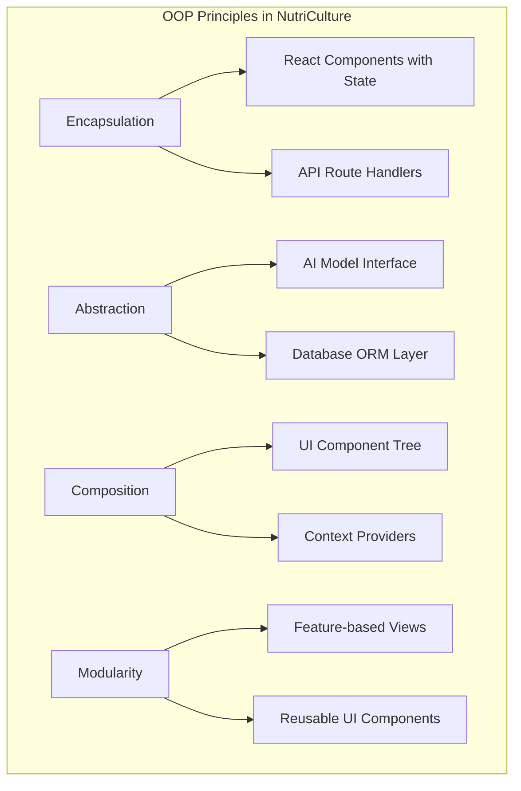
```mermaid
graph TD
    subgraph "OOP Principles in NutriCulture"
        A[Encapsulation] --> A1[React Components with State]
        A --> A2[API Route Handlers]
        
        B[Abstraction] --> B1[AI Model Interface]
        B --> B2[Database ORM Layer]
        
        C[Composition] --> C1[UI Component Tree]
        C --> C2[Context Providers]
        
        D[Modularity] --> D1[Feature-based Views]
        D --> D2[Reusable UI Components]
    end
```

### 1.2 Software Process Model: Agile with Iterative Development

**Justification:**

NutriCulture follows an **Agile Iterative Development** model:

1. **Incremental Feature Development**: Features are developed incrementally (BMI Calculator → Nutrition Analysis → Meal Suggestions → Recipes).

2. **Continuous Integration**: Next.js with Vercel enables continuous deployment and integration.

3. **User Feedback Loops**: AI chat allows real-time user feedback incorporation.

4. **Flexibility**: Easy to add new nutrition modules without disrupting existing functionality.

5. **Sprint-Based Development**: Features organized into independent modules allow parallel development.

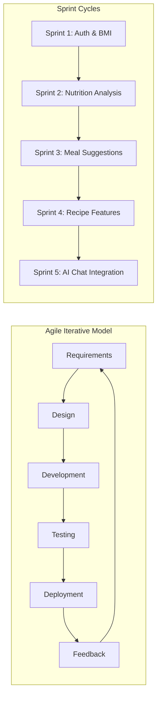
```mermaid
graph LR
    subgraph "Agile Iterative Model"
        A[Requirements] --> B[Design]
        B --> C[Development]
        C --> D[Testing]
        D --> E[Deployment]
        E --> F[Feedback]
        F --> A
    end
    
    subgraph "Sprint Cycles"
        S1[Sprint 1: Auth & BMI]
        S2[Sprint 2: Nutrition Analysis]
        S3[Sprint 3: Meal Suggestions]
        S4[Sprint 4: Recipe Features]
        S5[Sprint 5: AI Chat Integration]
    end
    
    S1 --> S2 --> S3 --> S4 --> S5
```

---

## 2. System Overview

### 2.1 General Description

NutriCulture is an AI-powered nutrition platform that provides personalized nutrition guidance, meal planning, and healthy lifestyle management. The system combines an interactive AI assistant with comprehensive nutrition analysis tools to help users achieve their health goals.

### 2.2 System Context

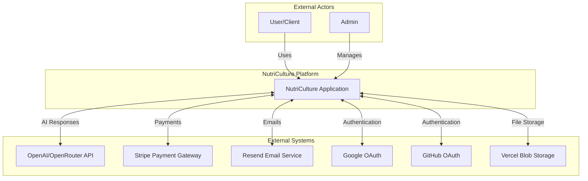
```mermaid
graph TB
    subgraph "External Actors"
        U[User/Client]
        A[Admin]
    end
    
    subgraph "External Systems"
        AI[OpenAI/OpenRouter API]
        ST[Stripe Payment Gateway]
        RE[Resend Email Service]
        GA[Google OAuth]
        GH[GitHub OAuth]
        VB[Vercel Blob Storage]
    end
    
    subgraph "NutriCulture Platform"
        NC[NutriCulture Application]
    end
    
    U -->|Uses| NC
    A -->|Manages| NC
    NC <-->|AI Responses| AI
    NC <-->|Payments| ST
    NC <-->|Emails| RE
    NC <-->|Authentication| GA
    NC <-->|Authentication| GH
    NC <-->|File Storage| VB
```

### 2.3 Core Functionality

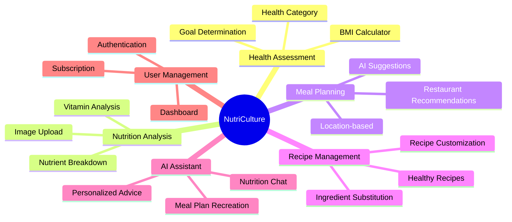
```mermaid
mindmap
  root((NutriCulture))
    Health Assessment
      BMI Calculator
      Goal Determination
      Health Category
    Nutrition Analysis
      Image Upload
      Nutrient Breakdown
      Vitamin Analysis
    Meal Planning
      AI Suggestions
      Restaurant Recommendations
      Location-based
    Recipe Management
      Healthy Recipes
      Recipe Customization
      Ingredient Substitution
    AI Assistant
      Nutrition Chat
      Personalized Advice
      Meal Plan Recreation
    User Management
      Authentication
      Subscription
      Dashboard
```

### 2.4 Technology Stack

| Layer | Technology |
|-------|------------|
| Frontend | Next.js 15, React, TypeScript, Tailwind CSS |
| UI Components | Shadcn/UI |
| Backend | Next.js API Routes |
| Database | PostgreSQL with DrizzleORM |
| Authentication | Better Auth |
| AI Integration | OpenAI SDK, OpenRouter |
| Email | Resend, React Email |
| Payments | Stripe |
| Deployment | Vercel |

---

## 3. Architectural Design

### 3.1 High-Level Architecture

NutriCulture follows a **Layered Architecture** with **Client-Server** model:

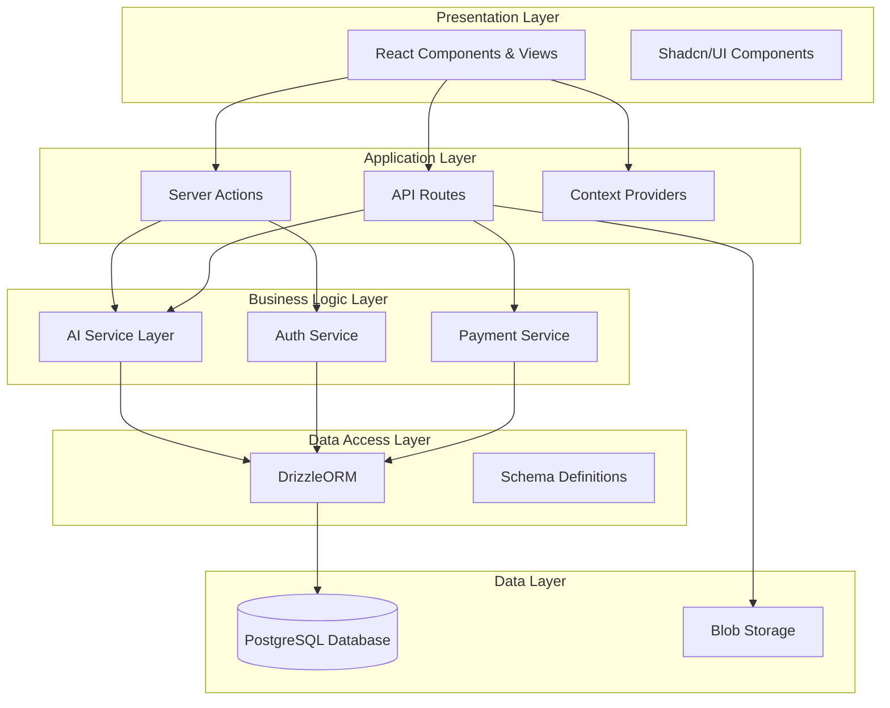
```mermaid
graph TB
    subgraph "Presentation Layer"
        UI[React Components & Views]
        SC[Shadcn/UI Components]
    end
    
    subgraph "Application Layer"
        SA[Server Actions]
        AR[API Routes]
        CT[Context Providers]
    end
    
    subgraph "Business Logic Layer"
        AI[AI Service Layer]
        AU[Auth Service]
        PM[Payment Service]
    end
    
    subgraph "Data Access Layer"
        ORM[DrizzleORM]
        SC2[Schema Definitions]
    end
    
    subgraph "Data Layer"
        DB[(PostgreSQL Database)]
        BL[Blob Storage]
    end
    
    UI --> SA
    UI --> AR
    UI --> CT
    SA --> AI
    SA --> AU
    AR --> AI
    AR --> PM
    AI --> ORM
    AU --> ORM
    PM --> ORM
    ORM --> DB
    AR --> BL
```

### 3.2 Module Decomposition

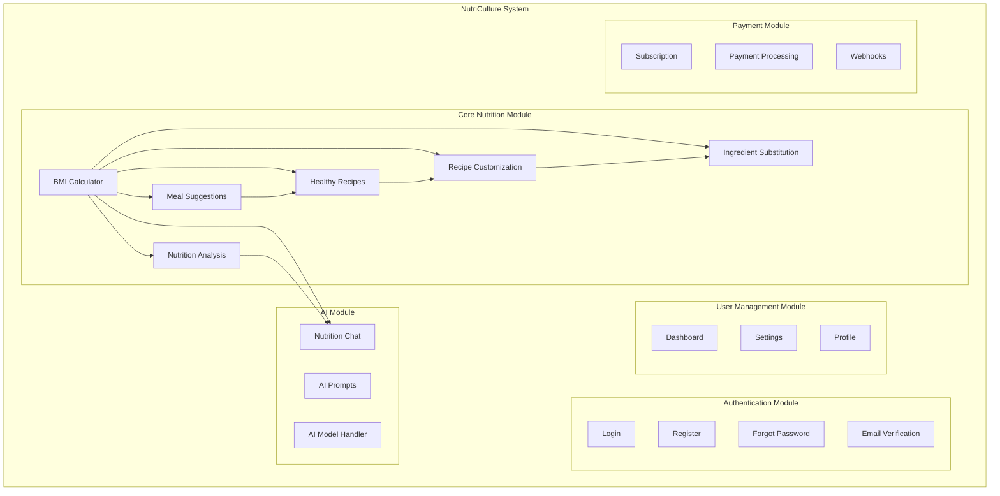
```mermaid
graph TB
    subgraph "NutriCulture System"
        subgraph "Authentication Module"
            LM[Login]
            RM[Register]
            FP[Forgot Password]
            EV[Email Verification]
        end
        
        subgraph "Core Nutrition Module"
            BC[BMI Calculator]
            NA[Nutrition Analysis]
            MS[Meal Suggestions]
            HR[Healthy Recipes]
            RC[Recipe Customization]
            IS[Ingredient Substitution]
        end
        
        subgraph "AI Module"
            NC[Nutrition Chat]
            AP[AI Prompts]
            AM[AI Model Handler]
        end
        
        subgraph "User Management Module"
            DB[Dashboard]
            ST[Settings]
            PR[Profile]
        end
        
        subgraph "Payment Module"
            SB[Subscription]
            PM[Payment Processing]
            WH[Webhooks]
        end
    end
    
    BC --> MS
    BC --> NA
    BC --> HR
    BC --> RC
    BC --> IS
    BC --> NC
    NA --> NC
    MS --> HR
    HR --> RC
    RC --> IS
```

### 3.3 Component Diagram

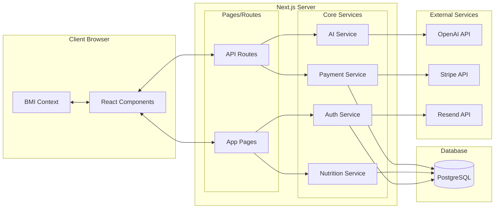
```mermaid
graph LR
    subgraph "Client Browser"
        RC[React Components]
        BX[BMI Context]
    end
    
    subgraph "Next.js Server"
        subgraph "Pages/Routes"
            AP[App Pages]
            API[API Routes]
        end
        
        subgraph "Core Services"
            AS[Auth Service]
            NS[Nutrition Service]
            AIS[AI Service]
            PS[Payment Service]
        end
    end
    
    subgraph "External Services"
        OAI[OpenAI API]
        STR[Stripe API]
        RES[Resend API]
    end
    
    subgraph "Database"
        PG[(PostgreSQL)]
    end
    
    RC <--> AP
    RC <--> API
    BX <--> RC
    AP --> AS
    AP --> NS
    API --> AIS
    API --> PS
    AIS --> OAI
    PS --> STR
    AS --> RES
    AS --> PG
    NS --> PG
    PS --> PG
```

### 3.4 Deployment Architecture

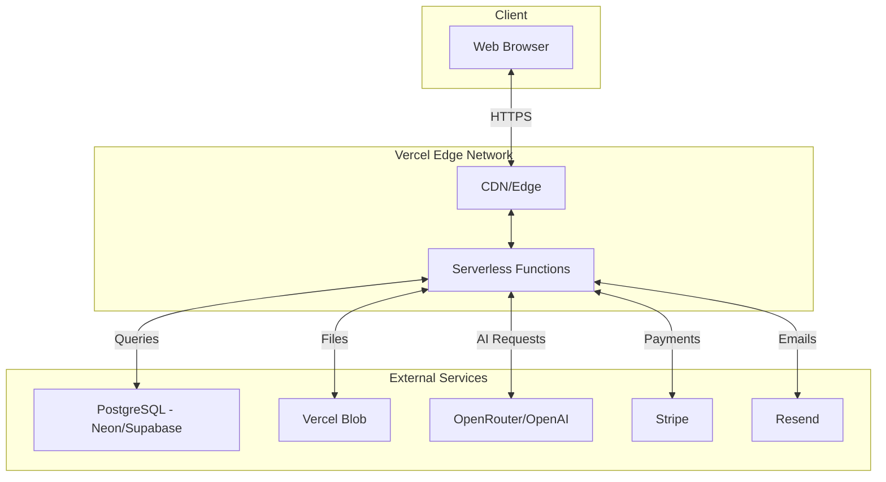
```mermaid
graph TB
    subgraph "Client"
        BR[Web Browser]
    end
    
    subgraph "Vercel Edge Network"
        CDN[CDN/Edge]
        SL[Serverless Functions]
    end
    
    subgraph "External Services"
        PG[PostgreSQL - Neon/Supabase]
        VB[Vercel Blob]
        AI[OpenRouter/OpenAI]
        ST[Stripe]
        RS[Resend]
    end
    
    BR <-->|HTTPS| CDN
    CDN <--> SL
    SL <-->|Queries| PG
    SL <-->|Files| VB
    SL <-->|AI Requests| AI
    SL <-->|Payments| ST
    SL <-->|Emails| RS
```

---

## 4. Process Flow/Representation

### 4.1 Main User Journey Activity Diagram

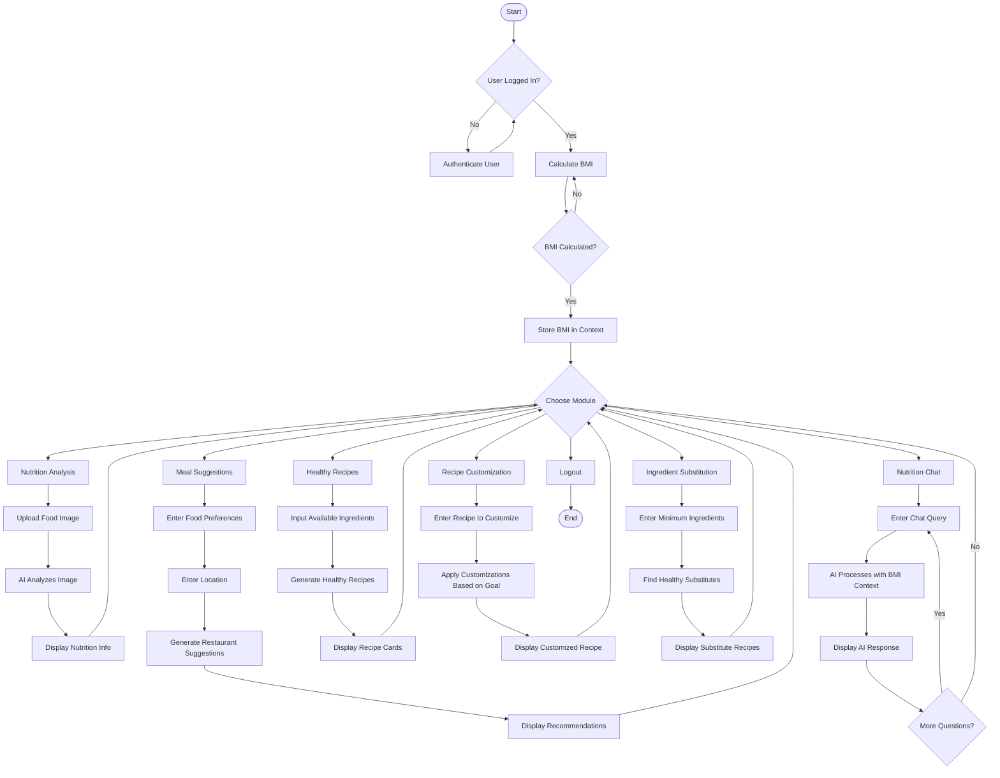
```mermaid
flowchart TD
    Start([Start]) --> Login{User Logged In?}
    Login -->|No| Auth[Authenticate User]
    Auth --> Login
    Login -->|Yes| BMI[Calculate BMI]
    
    BMI --> BMIResult{BMI Calculated?}
    BMIResult -->|Yes| StoreContext[Store BMI in Context]
    BMIResult -->|No| BMI
    
    StoreContext --> ChooseModule{Choose Module}
    
    ChooseModule --> NA[Nutrition Analysis]
    ChooseModule --> MS[Meal Suggestions]
    ChooseModule --> HR[Healthy Recipes]
    ChooseModule --> RC[Recipe Customization]
    ChooseModule --> IS[Ingredient Substitution]
    ChooseModule --> NC[Nutrition Chat]
    
    NA --> UploadImage[Upload Food Image]
    UploadImage --> AnalyzeImage[AI Analyzes Image]
    AnalyzeImage --> ShowNutrition[Display Nutrition Info]
    ShowNutrition --> ChooseModule
    
    MS --> EnterPrefs[Enter Food Preferences]
    EnterPrefs --> EnterLocation[Enter Location]
    EnterLocation --> GenerateSuggestions[Generate Restaurant Suggestions]
    GenerateSuggestions --> ShowRestaurants[Display Recommendations]
    ShowRestaurants --> ChooseModule
    
    HR --> InputIngredients[Input Available Ingredients]
    InputIngredients --> GenerateRecipes[Generate Healthy Recipes]
    GenerateRecipes --> ShowRecipes[Display Recipe Cards]
    ShowRecipes --> ChooseModule
    
    RC --> EnterRecipe[Enter Recipe to Customize]
    EnterRecipe --> CustomizeRecipe[Apply Customizations Based on Goal]
    CustomizeRecipe --> ShowCustomized[Display Customized Recipe]
    ShowCustomized --> ChooseModule
    
    IS --> EnterIngredients[Enter Minimum Ingredients]
    EnterIngredients --> FindSubstitutes[Find Healthy Substitutes]
    FindSubstitutes --> ShowSubstitutes[Display Substitute Recipes]
    ShowSubstitutes --> ChooseModule
    
    NC --> ChatQuery[Enter Chat Query]
    ChatQuery --> AIProcess[AI Processes with BMI Context]
    AIProcess --> ChatResponse[Display AI Response]
    ChatResponse --> MoreQuestions{More Questions?}
    MoreQuestions -->|Yes| ChatQuery
    MoreQuestions -->|No| ChooseModule
    
    ChooseModule --> Logout[Logout]
    Logout --> End([End])
```

### 4.2 Nutrition Analysis Process Flow

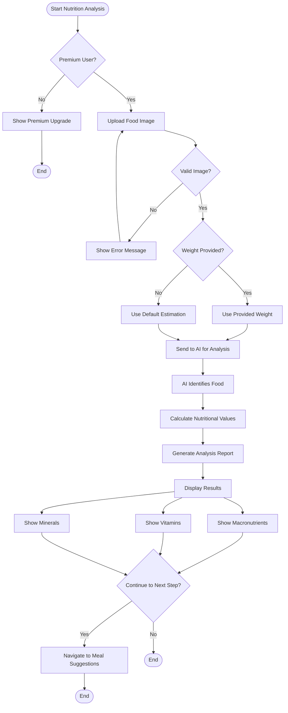
```mermaid
flowchart TD
    Start([Start Nutrition Analysis]) --> CheckPremium{Premium User?}
    CheckPremium -->|No| ShowUpgrade[Show Premium Upgrade]
    ShowUpgrade --> End1([End])
    
    CheckPremium -->|Yes| UploadImage[Upload Food Image]
    UploadImage --> ValidateImage{Valid Image?}
    ValidateImage -->|No| ShowError[Show Error Message]
    ShowError --> UploadImage
    
    ValidateImage -->|Yes| OptionalWeight{Weight Provided?}
    OptionalWeight -->|Yes| UseProvidedWeight[Use Provided Weight]
    OptionalWeight -->|No| EstimateWeight[Use Default Estimation]
    
    UseProvidedWeight --> SendToAI[Send to AI for Analysis]
    EstimateWeight --> SendToAI
    
    SendToAI --> ProcessImage[AI Identifies Food]
    ProcessImage --> CalculateNutrition[Calculate Nutritional Values]
    CalculateNutrition --> GenerateReport[Generate Analysis Report]
    
    GenerateReport --> DisplayResults[Display Results]
    DisplayResults --> ShowMacros[Show Macronutrients]
    DisplayResults --> ShowVitamins[Show Vitamins]
    DisplayResults --> ShowMinerals[Show Minerals]
    
    ShowMacros --> Proceed{Continue to Next Step?}
    ShowVitamins --> Proceed
    ShowMinerals --> Proceed
    
    Proceed -->|Yes| NavigateNext[Navigate to Meal Suggestions]
    Proceed -->|No| End2([End])
    NavigateNext --> End3([End])
```

### 4.3 AI Chat Process Flow

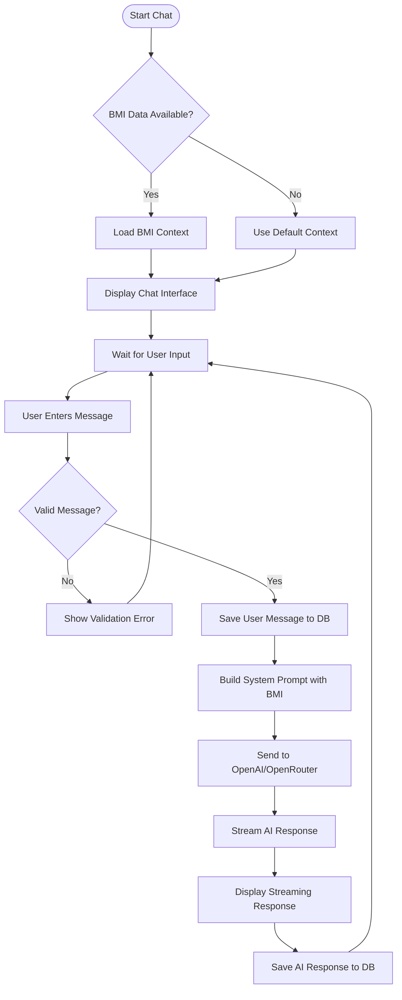
```mermaid
flowchart TD
    Start([Start Chat]) --> CheckBMI{BMI Data Available?}
    CheckBMI -->|Yes| LoadContext[Load BMI Context]
    CheckBMI -->|No| DefaultContext[Use Default Context]
    
    LoadContext --> ShowChat[Display Chat Interface]
    DefaultContext --> ShowChat
    
    ShowChat --> WaitInput[Wait for User Input]
    WaitInput --> UserMessage[User Enters Message]
    
    UserMessage --> ValidateInput{Valid Message?}
    ValidateInput -->|No| ShowInputError[Show Validation Error]
    ShowInputError --> WaitInput
    
    ValidateInput -->|Yes| SaveMessage[Save User Message to DB]
    SaveMessage --> BuildPrompt[Build System Prompt with BMI]
    
    BuildPrompt --> SendToAI[Send to OpenAI/OpenRouter]
    SendToAI --> StreamResponse[Stream AI Response]
    
    StreamResponse --> DisplayResponse[Display Streaming Response]
    DisplayResponse --> SaveResponse[Save AI Response to DB]
    
    SaveResponse --> WaitInput
```

---

## 5. Design Models

### 5.1 Class Diagram

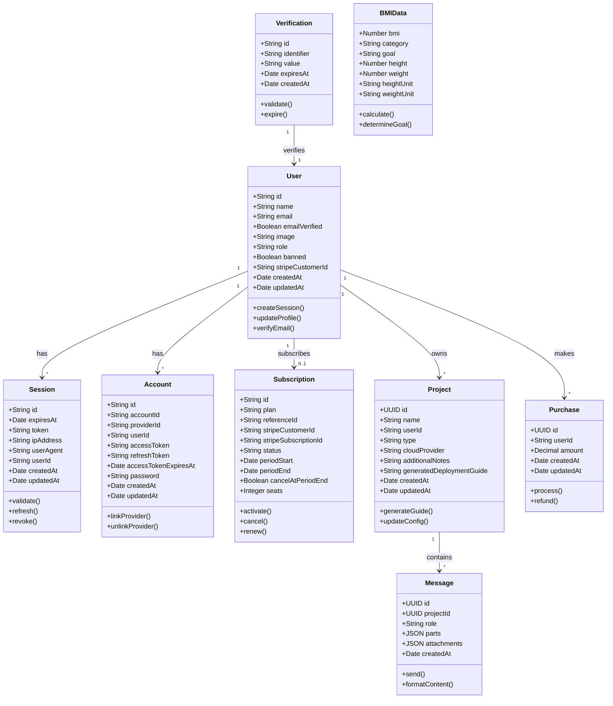
```mermaid
classDiagram
    class User {
        +String id
        +String name
        +String email
        +Boolean emailVerified
        +String image
        +String role
        +Boolean banned
        +String stripeCustomerId
        +Date createdAt
        +Date updatedAt
        +createSession()
        +updateProfile()
        +verifyEmail()
    }
    
    class Session {
        +String id
        +Date expiresAt
        +String token
        +String ipAddress
        +String userAgent
        +String userId
        +Date createdAt
        +Date updatedAt
        +validate()
        +refresh()
        +revoke()
    }
    
    class Account {
        +String id
        +String accountId
        +String providerId
        +String userId
        +String accessToken
        +String refreshToken
        +Date accessTokenExpiresAt
        +String password
        +Date createdAt
        +Date updatedAt
        +linkProvider()
        +unlinkProvider()
    }
    
    class Subscription {
        +String id
        +String plan
        +String referenceId
        +String stripeCustomerId
        +String stripeSubscriptionId
        +String status
        +Date periodStart
        +Date periodEnd
        +Boolean cancelAtPeriodEnd
        +Integer seats
        +activate()
        +cancel()
        +renew()
    }
    
    class Project {
        +UUID id
        +String name
        +String userId
        +String type
        +String cloudProvider
        +String additionalNotes
        +String generatedDeploymentGuide
        +Date createdAt
        +Date updatedAt
        +generateGuide()
        +updateConfig()
    }
    
    class Message {
        +UUID id
        +UUID projectId
        +String role
        +JSON parts
        +JSON attachments
        +Date createdAt
        +send()
        +formatContent()
    }
    
    class Purchase {
        +UUID id
        +String userId
        +Decimal amount
        +Date createdAt
        +Date updatedAt
        +process()
        +refund()
    }
    
    class Verification {
        +String id
        +String identifier
        +String value
        +Date expiresAt
        +Date createdAt
        +validate()
        +expire()
    }
    
    class BMIData {
        +Number bmi
        +String category
        +String goal
        +Number height
        +Number weight
        +String heightUnit
        +String weightUnit
        +calculate()
        +determineGoal()
    }
    
    User "1" --> "*" Session : has
    User "1" --> "*" Account : has
    User "1" --> "*" Project : owns
    User "1" --> "*" Purchase : makes
    User "1" --> "0..1" Subscription : subscribes
    Project "1" --> "*" Message : contains
    Verification "1" --> "1" User : verifies
```

### 5.2 Component Class Diagram (React Components)

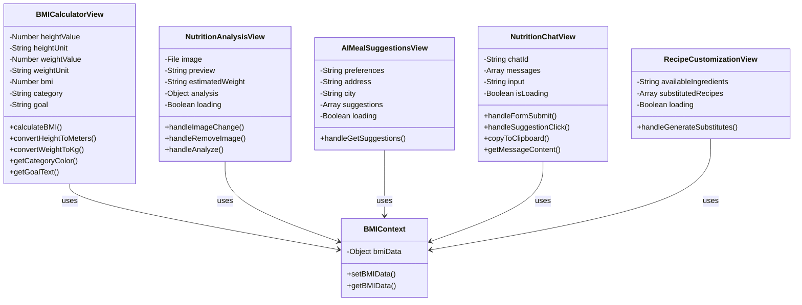
```mermaid
classDiagram
    class BMICalculatorView {
        -Number heightValue
        -String heightUnit
        -Number weightValue
        -String weightUnit
        -Number bmi
        -String category
        -String goal
        +calculateBMI()
        +convertHeightToMeters()
        +convertWeightToKg()
        +getCategoryColor()
        +getGoalText()
    }
    
    class NutritionAnalysisView {
        -File image
        -String preview
        -String estimatedWeight
        -Object analysis
        -Boolean loading
        +handleImageChange()
        +handleRemoveImage()
        +handleAnalyze()
    }
    
    class AIMealSuggestionsView {
        -String preferences
        -String address
        -String city
        -Array suggestions
        -Boolean loading
        +handleGetSuggestions()
    }
    
    class NutritionChatView {
        -String chatId
        -Array messages
        -String input
        -Boolean isLoading
        +handleFormSubmit()
        +handleSuggestionClick()
        +copyToClipboard()
        +getMessageContent()
    }
    
    class RecipeCustomizationView {
        -String availableIngredients
        -Array substitutedRecipes
        -Boolean loading
        +handleGenerateSubstitutes()
    }
    
    class BMIContext {
        -Object bmiData
        +setBMIData()
        +getBMIData()
    }
    
    BMICalculatorView --> BMIContext : uses
    NutritionAnalysisView --> BMIContext : uses
    AIMealSuggestionsView --> BMIContext : uses
    NutritionChatView --> BMIContext : uses
    RecipeCustomizationView --> BMIContext : uses
```

### 5.3 Sequence Diagram - BMI Calculation and Storage

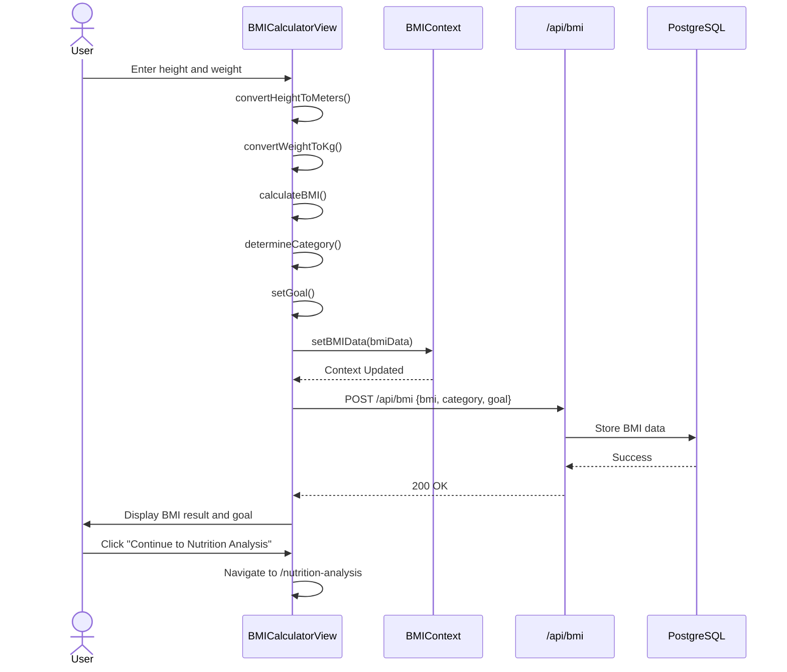
```mermaid
sequenceDiagram
    actor User
    participant UI as BMICalculatorView
    participant Context as BMIContext
    participant API as /api/bmi
    participant DB as PostgreSQL
    
    User->>UI: Enter height and weight
    UI->>UI: convertHeightToMeters()
    UI->>UI: convertWeightToKg()
    UI->>UI: calculateBMI()
    UI->>UI: determineCategory()
    UI->>UI: setGoal()
    
    UI->>Context: setBMIData(bmiData)
    Context-->>UI: Context Updated
    
    UI->>API: POST /api/bmi {bmi, category, goal}
    API->>DB: Store BMI data
    DB-->>API: Success
    API-->>UI: 200 OK
    
    UI->>User: Display BMI result and goal
    User->>UI: Click "Continue to Nutrition Analysis"
    UI->>UI: Navigate to /nutrition-analysis
```

### 5.4 Sequence Diagram - Nutrition Chat

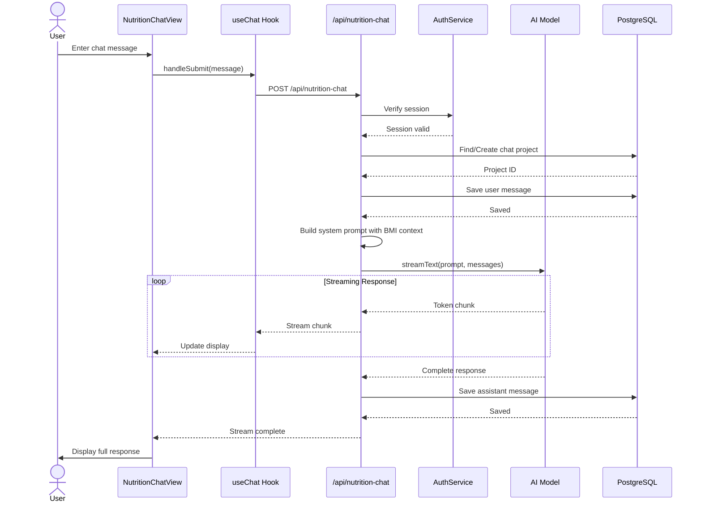
```mermaid
sequenceDiagram
    actor User
    participant UI as NutritionChatView
    participant Chat as useChat Hook
    participant API as /api/nutrition-chat
    participant Auth as AuthService
    participant Model as AI Model
    participant DB as PostgreSQL
    
    User->>UI: Enter chat message
    UI->>Chat: handleSubmit(message)
    Chat->>API: POST /api/nutrition-chat
    
    API->>Auth: Verify session
    Auth-->>API: Session valid
    
    API->>DB: Find/Create chat project
    DB-->>API: Project ID
    
    API->>DB: Save user message
    DB-->>API: Saved
    
    API->>API: Build system prompt with BMI context
    API->>Model: streamText(prompt, messages)
    
    loop Streaming Response
        Model-->>API: Token chunk
        API-->>Chat: Stream chunk
        Chat-->>UI: Update display
    end
    
    Model-->>API: Complete response
    API->>DB: Save assistant message
    DB-->>API: Saved
    
    API-->>UI: Stream complete
    UI->>User: Display full response
```

### 5.5 Sequence Diagram - Subscription Flow

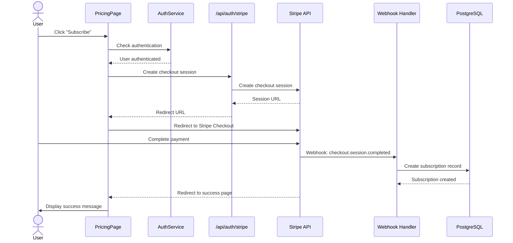
```mermaid
sequenceDiagram
    actor User
    participant UI as PricingPage
    participant Auth as AuthService
    participant API as /api/auth/stripe
    participant Stripe as Stripe API
    participant WH as Webhook Handler
    participant DB as PostgreSQL
    
    User->>UI: Click "Subscribe"
    UI->>Auth: Check authentication
    Auth-->>UI: User authenticated
    
    UI->>API: Create checkout session
    API->>Stripe: Create checkout session
    Stripe-->>API: Session URL
    API-->>UI: Redirect URL
    
    UI->>Stripe: Redirect to Stripe Checkout
    User->>Stripe: Complete payment
    
    Stripe->>WH: Webhook: checkout.session.completed
    WH->>DB: Create subscription record
    DB-->>WH: Subscription created
    
    Stripe-->>UI: Redirect to success page
    UI->>User: Display success message
```

### 5.6 State Transition Diagram - User Authentication

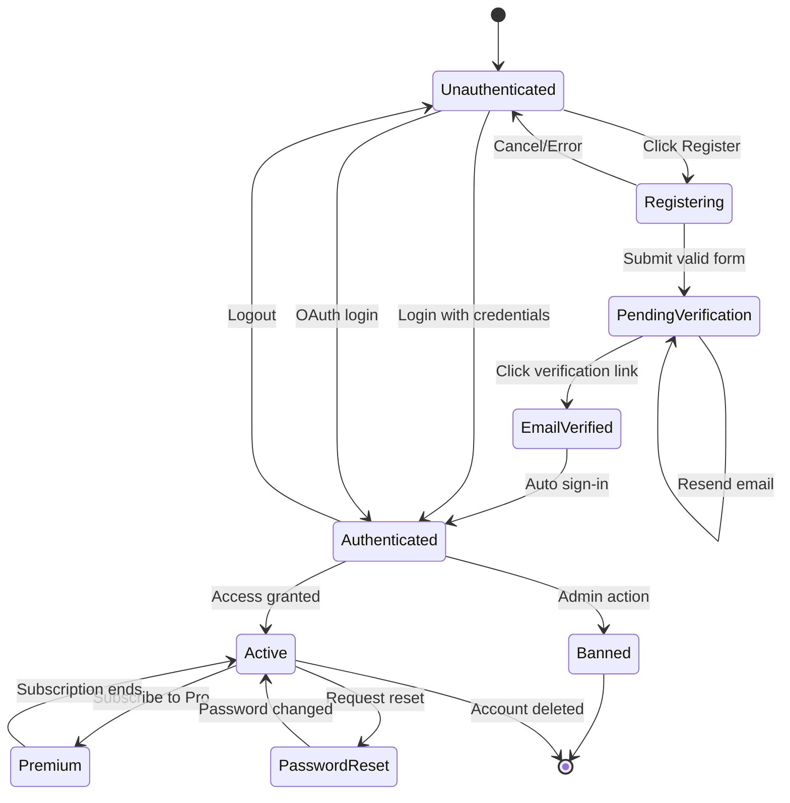
```mermaid
stateDiagram-v2
    [*] --> Unauthenticated
    
    Unauthenticated --> Registering : Click Register
    Registering --> PendingVerification : Submit valid form
    Registering --> Unauthenticated : Cancel/Error
    
    PendingVerification --> EmailVerified : Click verification link
    PendingVerification --> PendingVerification : Resend email
    
    EmailVerified --> Authenticated : Auto sign-in
    
    Unauthenticated --> Authenticated : Login with credentials
    Unauthenticated --> Authenticated : OAuth login
    
    Authenticated --> Active : Access granted
    Active --> Premium : Subscribe to Pro
    Premium --> Active : Subscription ends
    
    Active --> PasswordReset : Request reset
    PasswordReset --> Active : Password changed
    
    Authenticated --> Unauthenticated : Logout
    Authenticated --> Banned : Admin action
    Banned --> [*]
    
    Active --> [*] : Account deleted
```

### 5.7 State Transition Diagram - BMI Workflow

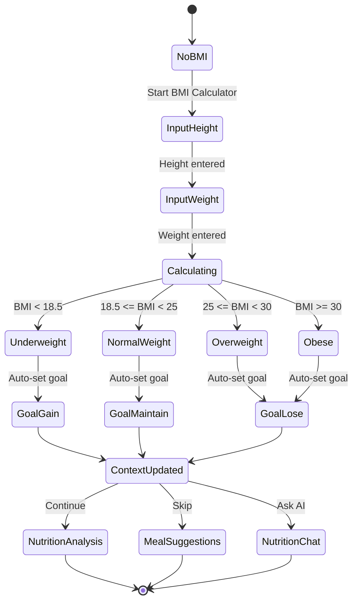
```mermaid
stateDiagram-v2
    [*] --> NoBMI
    
    NoBMI --> InputHeight : Start BMI Calculator
    InputHeight --> InputWeight : Height entered
    InputWeight --> Calculating : Weight entered
    
    Calculating --> Underweight : BMI < 18.5
    Calculating --> NormalWeight : 18.5 <= BMI < 25
    Calculating --> Overweight : 25 <= BMI < 30
    Calculating --> Obese : BMI >= 30
    
    Underweight --> GoalGain : Auto-set goal
    NormalWeight --> GoalMaintain : Auto-set goal
    Overweight --> GoalLose : Auto-set goal
    Obese --> GoalLose : Auto-set goal
    
    GoalGain --> ContextUpdated
    GoalMaintain --> ContextUpdated
    GoalLose --> ContextUpdated
    
    ContextUpdated --> NutritionAnalysis : Continue
    ContextUpdated --> MealSuggestions : Skip
    ContextUpdated --> NutritionChat : Ask AI
    
    NutritionAnalysis --> [*]
    MealSuggestions --> [*]
    NutritionChat --> [*]
```

### 5.8 Data Flow Diagram - Level 0 (Context Diagram)

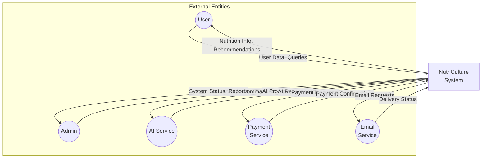
```mermaid
flowchart TB
    subgraph External Entities
        U((User))
        A((Admin))
        AI((AI Service))
        PM((Payment<br/>Service))
        EM((Email<br/>Service))
    end
    
    NC[NutriCulture<br/>System]
    
    U -->|User Data, Queries| NC
    NC -->|Nutrition Info, Recommendations| U
    
    A -->|Admin Commands| NC
    NC -->|System Status, Reports| A
    
    NC -->|AI Prompts| AI
    AI -->|AI Responses| NC
    
    NC -->|Payment Requests| PM
    PM -->|Payment Confirmations| NC
    
    NC -->|Email Requests| EM
    EM -->|Delivery Status| NC
```

### 5.9 Data Flow Diagram - Level 1

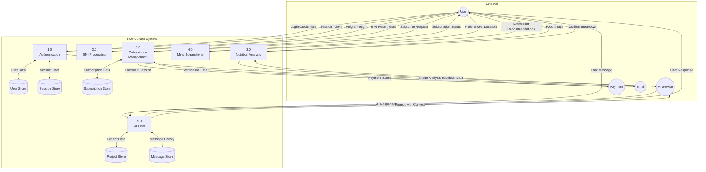
```mermaid
flowchart TB
    subgraph External
        U((User))
        AI((AI Service))
        PM((Payment))
        EM((Email))
    end
    
    subgraph "NutriCulture System"
        P1[1.0<br/>Authentication]
        P2[2.0<br/>BMI Processing]
        P3[3.0<br/>Nutrition Analysis]
        P4[4.0<br/>Meal Suggestions]
        P5[5.0<br/>AI Chat]
        P6[6.0<br/>Subscription<br/>Management]
        
        D1[(User Store)]
        D2[(Session Store)]
        D3[(Project Store)]
        D4[(Message Store)]
        D5[(Subscription Store)]
    end
    
    U -->|Login Credentials| P1
    P1 -->|Session Token| U
    P1 <-->|User Data| D1
    P1 <-->|Session Data| D2
    P1 -->|Verification Email| EM
    
    U -->|Height, Weight| P2
    P2 -->|BMI Result, Goal| U
    
    U -->|Food Image| P3
    P3 -->|Image Analysis Request| AI
    AI -->|Nutrition Data| P3
    P3 -->|Nutrition Breakdown| U
    
    U -->|Preferences, Location| P4
    P4 -->|Restaurant Recommendations| U
    
    U -->|Chat Message| P5
    P5 <-->|Project Data| D3
    P5 <-->|Message History| D4
    P5 -->|Prompt with Context| AI
    AI -->|AI Response| P5
    P5 -->|Chat Response| U
    
    U -->|Subscribe Request| P6
    P6 -->|Checkout Session| PM
    PM -->|Payment Status| P6
    P6 <-->|Subscription Data| D5
    P6 -->|Subscription Status| U
```

### 5.10 Data Flow Diagram - Level 2 (AI Chat Process)

```mermaid
flowchart TB
    subgraph External
        U((User))
        AI((OpenAI/<br/>OpenRouter))
    end
    
    subgraph "5.0 AI Chat Process"
        P5_1[5.1<br/>Validate<br/>Session]
        P5_2[5.2<br/>Load/Create<br/>Chat Project]
        P5_3[5.3<br/>Save User<br/>Message]
        P5_4[5.4<br/>Build<br/>System Prompt]
        P5_5[5.5<br/>Stream<br/>AI Response]
        P5_6[5.6<br/>Save AI<br/>Response]
        
        D3[(Project<br/>Store)]
        D4[(Message<br/>Store)]
        D6[(BMI<br/>Context)]
    end
    
    U -->|Chat Message| P5_1
    P5_1 -->|Valid Session| P5_2
    P5_2 <-->|Project Data| D3
    P5_2 -->|Project ID| P5_3
    P5_3 -->|User Message| D4
    P5_3 -->|Message Saved| P5_4
    D6 -->|BMI Data| P5_4
    P5_4 -->|Full Prompt| P5_5
    P5_5 -->|API Request| AI
    AI -->|Streaming Response| P5_5
    P5_5 -->|Response Chunks| U
    P5_5 -->|Complete Response| P5_6
    P5_6 -->|AI Message| D4
```

---

## 6. Data Design

### 6.1 Entity-Relationship Diagram

```mermaid
erDiagram
    USERS ||--o{ SESSIONS : has
    USERS ||--o{ ACCOUNTS : has
    USERS ||--o{ PROJECTS : owns
    USERS ||--o{ PURCHASES : makes
    USERS ||--o| SUBSCRIPTIONS : subscribes
    PROJECTS ||--o{ MESSAGES : contains
    
    USERS {
        text id PK
        text name
        text email UK
        boolean emailVerified
        text image
        text role
        boolean banned
        text banReason
        timestamp banExpires
        text stripeCustomerId
        timestamp createdAt
        timestamp updatedAt
    }
    
    SESSIONS {
        text id PK
        timestamp expiresAt
        text token UK
        text ipAddress
        text userAgent
        text impersonatedBy
        text userId FK
        timestamp createdAt
        timestamp updatedAt
    }
    
    ACCOUNTS {
        text id PK
        text accountId
        text providerId
        text userId FK
        text accessToken
        text refreshToken
        text idToken
        timestamp accessTokenExpiresAt
        timestamp refreshTokenExpiresAt
        text scope
        text password
        timestamp createdAt
        timestamp updatedAt
    }
    
    SUBSCRIPTIONS {
        text id PK
        text plan
        text referenceId
        text stripeCustomerId
        text stripeSubscriptionId
        text status
        timestamp periodStart
        timestamp periodEnd
        boolean cancelAtPeriodEnd
        integer seats
    }
    
    PROJECTS {
        uuid id PK
        text name
        text userId FK
        text cloudProvider
        text additionalNotes
        text type
        text configFileContent
        text optimizationType
        text applicationType
        text language
        text framework
        text generatedDeploymentGuide
        timestamp createdAt
        timestamp updatedAt
    }
    
    MESSAGES {
        uuid id PK
        uuid projectId FK
        text role
        json parts
        json attachments
        timestamp createdAt
    }
    
    PURCHASES {
        uuid id PK
        text userId FK
        numeric amount
        timestamp createdAt
        timestamp updatedAt
    }
    
    VERIFICATIONS {
        text id PK
        text identifier
        text value
        timestamp expiresAt
        timestamp createdAt
        timestamp updatedAt
    }
```

### 6.2 Data Storage Organization

| Data Store | Type | Purpose |
|------------|------|---------|
| PostgreSQL | Relational DB | Primary data storage for users, sessions, projects, messages |
| Vercel Blob | Object Storage | File uploads (food images) |
| React Context | In-memory | BMI data shared across components |
| Local Storage | Browser | Session persistence, theme preferences |

### 6.3 Data Flow Organization

```mermaid
flowchart LR
    subgraph "Data Sources"
        UI[User Input]
        AI[AI Responses]
        PM[Payment Events]
    end
    
    subgraph "Processing"
        API[API Routes]
        SA[Server Actions]
    end
    
    subgraph "Storage"
        PG[(PostgreSQL)]
        VB[(Vercel Blob)]
        CTX[React Context]
    end
    
    UI --> API
    UI --> SA
    UI --> CTX
    AI --> API
    PM --> API
    
    API --> PG
    API --> VB
    SA --> PG
```

---

## 7. Data Dictionary

### 7.1 Database Entities

| Entity | Attribute | Type | Description |
|--------|-----------|------|-------------|
| **users** | id | text | Primary key, unique user identifier |
| | name | text | User's full name |
| | email | text | User's email address (unique) |
| | emailVerified | boolean | Whether email is verified |
| | image | text | URL to profile image |
| | role | text | User role (user/admin) |
| | banned | boolean | Account ban status |
| | stripeCustomerId | text | Stripe customer ID for payments |
| | createdAt | timestamp | Account creation time |
| | updatedAt | timestamp | Last update time |
| **sessions** | id | text | Primary key, session identifier |
| | expiresAt | timestamp | Session expiration time |
| | token | text | Session token (unique) |
| | ipAddress | text | Client IP address |
| | userAgent | text | Client browser/device info |
| | userId | text | Foreign key to users table |
| **accounts** | id | text | Primary key, account identifier |
| | accountId | text | OAuth provider account ID |
| | providerId | text | OAuth provider name |
| | userId | text | Foreign key to users table |
| | password | text | Hashed password (credentials) |
| | accessToken | text | OAuth access token |
| **subscriptions** | id | text | Primary key, subscription ID |
| | plan | text | Subscription plan name |
| | status | text | Subscription status |
| | stripeSubscriptionId | text | Stripe subscription ID |
| | periodStart | timestamp | Billing period start |
| | periodEnd | timestamp | Billing period end |
| **projects** | id | uuid | Primary key, project identifier |
| | name | text | Project name |
| | userId | text | Foreign key to users table |
| | type | text | Project type (nutrition-chat) |
| | generatedDeploymentGuide | text | AI-generated content |
| **messages** | id | uuid | Primary key, message identifier |
| | projectId | uuid | Foreign key to projects table |
| | role | text | Message role (user/assistant) |
| | parts | json | Message content parts |
| | attachments | json | File attachments |
| **purchases** | id | uuid | Primary key, purchase identifier |
| | userId | text | Foreign key to users table |
| | amount | numeric | Purchase amount |

### 7.2 Application Objects

| Object | Attribute | Type | Description |
|--------|-----------|------|-------------|
| **BMIData** | bmi | number | Calculated BMI value |
| | category | string | BMI category (Underweight/Normal/Overweight/Obese) |
| | goal | string | Health goal (lose/gain/maintain) |
| | height | number | Height in cm |
| | weight | number | Weight in kg |
| | heightUnit | string | Height unit (cm/ft/in) |
| | weightUnit | string | Weight unit (kg/lb) |
| **NutritionAnalysis** | dishName | string | Identified dish name |
| | weight | string | Estimated weight |
| | nutrition | object | Macronutrient breakdown |
| | vitamins | object | Vitamin content |
| | minerals | object | Mineral content |
| **MealSuggestion** | name | string | Restaurant name |
| | dish | string | Recommended dish |
| | address | string | Restaurant address |
| | distance | string | Distance from user |
| | cuisine | string | Cuisine type |
| | price | string | Price range |
| | rating | number | Restaurant rating |

### 7.3 Functions/Methods Dictionary

| Component | Method | Parameters | Return | Description |
|-----------|--------|------------|--------|-------------|
| **BMICalculatorView** | calculateBMI | - | void | Calculates BMI and sets goal |
| | convertHeightToMeters | - | number | Converts height to meters |
| | convertWeightToKg | - | number | Converts weight to kg |
| **NutritionAnalysisView** | handleImageChange | event | void | Handles image upload |
| | handleAnalyze | - | Promise | Analyzes uploaded image |
| **NutritionChatView** | handleFormSubmit | event | void | Submits chat message |
| | copyToClipboard | text, id | Promise | Copies message to clipboard |
| **Auth Service** | signIn | credentials | Promise<Session> | Authenticates user |
| | signUp | userData | Promise<User> | Creates new user |
| | signOut | - | Promise | Ends user session |
| **AI Service** | streamText | model, messages, system | Stream | Streams AI response |

---

## 8. Algorithm & Implementation

### 8.1 BMI Calculation Algorithm

```
ALGORITHM CalculateBMI
INPUT: height, heightUnit, weight, weightUnit
OUTPUT: bmi, category, goal

BEGIN
    // Convert height to meters
    IF heightUnit == "cm" THEN
        heightInMeters = height / 100
    ELSE IF heightUnit == "ft" THEN
        heightInMeters = (feet * 12 + inches) * 0.0254
    ELSE IF heightUnit == "in" THEN
        heightInMeters = height * 0.0254
    END IF
    
    // Convert weight to kg
    IF weightUnit == "kg" THEN
        weightInKg = weight
    ELSE IF weightUnit == "lb" THEN
        weightInKg = weight * 0.453592
    END IF
    
    // Calculate BMI
    bmi = weightInKg / (heightInMeters * heightInMeters)
    bmi = ROUND(bmi, 1)
    
    // Determine category and goal
    IF bmi < 18.5 THEN
        category = "Underweight"
        goal = "gain"
    ELSE IF bmi < 25 THEN
        category = "Normal weight"
        goal = "maintain"
    ELSE IF bmi < 30 THEN
        category = "Overweight"
        goal = "lose"
    ELSE
        category = "Obese"
        goal = "lose"
    END IF
    
    // Store in context
    CALL setBMIData(bmi, category, goal, height, weight)
    
    // Send to backend
    CALL POST("/api/bmi", {bmi, category, goal, height, weight})
    
    RETURN bmi, category, goal
END
```

### 8.2 Nutrition Chat Processing Algorithm

```
ALGORITHM ProcessNutritionChat
INPUT: chatId, userMessage, bmiData
OUTPUT: aiResponse (streamed)

BEGIN
    // Validate session
    session = CALL currentSession()
    IF session == NULL THEN
        REDIRECT to "/login"
        RETURN
    END IF
    
    // Find or create chat project
    chat = QUERY projects WHERE id == chatId AND userId == session.user.id
    IF chat == NULL THEN
        chat = INSERT INTO projects (id, name, userId, type)
                VALUES (chatId, "Nutrition Chat", session.user.id, "nutrition-chat")
    END IF
    
    // Save user message
    INSERT INTO messages (id, role, parts, attachments, createdAt, projectId)
    VALUES (messageId, "user", messageParts, [], NOW(), chat.id)
    
    // Build system prompt with BMI context
    systemPrompt = NUTRITION_CHAT_SYSTEM_PROMPT
    IF bmiData != NULL THEN
        bmiContext = FORMAT("BMI: {bmi}, Category: {category}, Goal: {goal}")
        systemPrompt = systemPrompt + bmiContext
    END IF
    
    // Stream AI response
    result = CALL streamText(
        model: chatModel,
        messages: messages,
        system: systemPrompt
    )
    
    // On completion, save assistant message
    ON result.finish DO
        assistantMessage = result.response.messages
        INSERT INTO messages (id, role, parts, attachments, createdAt, projectId)
        VALUES (assistantId, "assistant", assistantParts, [], NOW(), chat.id)
    END ON
    
    RETURN result.toDataStreamResponse()
END
```

### 8.3 Meal Suggestions Algorithm

```
ALGORITHM GenerateMealSuggestions
INPUT: preferences, address, city, bmiData
OUTPUT: restaurantSuggestions

BEGIN
    // Validate inputs
    IF preferences == EMPTY OR address == EMPTY OR city == EMPTY THEN
        SHOW ERROR "Please fill all required fields"
        RETURN
    END IF
    
    // Get restaurant data (in production: API call to location service)
    restaurants = FETCH_RESTAURANTS(address, city)
    
    // Filter based on user goal
    IF bmiData.goal == "lose" THEN
        filteredRestaurants = FILTER restaurants WHERE
            dish CONTAINS "salad" OR
            dish CONTAINS "bowl" OR
            cuisine == "Healthy"
    ELSE IF bmiData.goal == "gain" THEN
        filteredRestaurants = FILTER restaurants WHERE
            dish CONTAINS "protein" OR
            dish CONTAINS "beef" OR
            cuisine == "American"
    ELSE
        filteredRestaurants = restaurants
    END IF
    
    // Sort by rating and distance
    sortedRestaurants = SORT filteredRestaurants BY rating DESC, distance ASC
    
    // Return top recommendations
    RETURN sortedRestaurants[0:5]
END
```

### 8.4 Authentication Flow Algorithm

```
ALGORITHM AuthenticateUser
INPUT: email, password OR oauthProvider
OUTPUT: session, user

BEGIN
    // Credential authentication
    IF email AND password THEN
        account = QUERY accounts WHERE email == email
        IF account == NULL THEN
            RETURN ERROR "User not found"
        END IF
        
        IF NOT VERIFY(password, account.password) THEN
            RETURN ERROR "Invalid password"
        END IF
        
        user = QUERY users WHERE id == account.userId
        
    // OAuth authentication
    ELSE IF oauthProvider THEN
        oauthData = CALL oauthProvider.authenticate()
        
        account = QUERY accounts WHERE 
            providerId == oauthProvider AND 
            accountId == oauthData.id
            
        IF account == NULL THEN
            // Create new user and account
            user = INSERT INTO users (name, email, emailVerified)
                   VALUES (oauthData.name, oauthData.email, TRUE)
            account = INSERT INTO accounts (providerId, accountId, userId)
                      VALUES (oauthProvider, oauthData.id, user.id)
        ELSE
            user = QUERY users WHERE id == account.userId
        END IF
    END IF
    
    // Create session
    session = INSERT INTO sessions (token, userId, expiresAt)
              VALUES (GENERATE_TOKEN(), user.id, NOW() + 7 DAYS)
    
    // Check email verification
    IF NOT user.emailVerified THEN
        SHOW "Please verify your email"
    END IF
    
    RETURN session, user
END
```

---

## 9. Software Requirements Traceability Matrix

| Req. No. | Requirement | Design Component | Component Items |
|----------|-------------|------------------|-----------------|
| FR01 | User Registration | Class Diagram | User, Account, Verification |
| FR02 | User Login | Sequence Diagram | AuthenticateUser() |
| FR03 | BMI Calculation | Class Diagram, Activity Diagram | BMICalculatorView, calculateBMI() |
| FR04 | Store BMI Data | Class Diagram | BMIContext, setBMIData() |
| FR05 | Nutrition Analysis | Class Diagram, DFD L2 | NutritionAnalysisView, handleAnalyze() |
| FR06 | AI Meal Suggestions | Class Diagram | AIMealSuggestionsView, handleGetSuggestions() |
| FR07 | Healthy Recipes | Class Diagram | HealthyRecipesView |
| FR08 | Recipe Customization | Class Diagram | RecipeCustomizationView, handleGenerateSubstitutes() |
| FR09 | Ingredient Substitution | Class Diagram | IngredientSubstitutionView |
| FR10 | AI Nutrition Chat | Sequence Diagram, DFD L2 | NutritionChatView, ProcessNutritionChat() |
| FR11 | Premium Subscription | Sequence Diagram | Subscription, SubscriptionFlow |
| FR12 | Dashboard | Class Diagram | DashboardView |
| FR13 | User Settings | Class Diagram | SettingsView, updateProfile() |
| FR14 | Email Verification | State Diagram | Verification, EmailVerified state |
| FR15 | Password Reset | State Diagram | PasswordReset state |
| NFR01 | Data Persistence | ERD | PostgreSQL schema |
| NFR02 | Security (Authentication) | Sequence Diagram | Auth Service, Session |
| NFR03 | AI Integration | Component Diagram | AI Module, OpenRouter |
| NFR04 | Responsive UI | Architecture Diagram | React Components, Tailwind CSS |
| NFR05 | Payment Security | Sequence Diagram | Stripe Integration |

---

## 10. Human Interface Design

### 10.1 User Interface Overview

The NutriCulture interface is designed with modern UX principles:

- **Responsive Design**: Mobile-first approach with full desktop support
- **Dark/Light Mode**: Theme switching with system preference detection
- **Gradient Themes**: Modern gradient-based color scheme (green/emerald palette)
- **Interactive Elements**: Hover effects, loading states, smooth transitions
- **Accessibility**: WCAG compliant components

### 10.2 Screen Flow Diagram

```mermaid
flowchart TD
    subgraph "Public Pages"
        HP[Home Page]
        LP[Login Page]
        RP[Register Page]
        FP[Forgot Password]
        PR[Pricing Page]
        SV[Services Page]
    end
    
    subgraph "Protected Pages"
        GS[Get Started]
        BC[BMI Calculator]
        NA[Nutrition Analysis]
        MS[AI Meal Suggestions]
        HR[Healthy Recipes]
        RC[Recipe Customization]
        IS[Ingredient Substitution]
        NC[Nutrition Chat]
        DB[Dashboard]
        ST[Settings]
    end
    
    HP --> LP
    HP --> RP
    HP --> PR
    HP --> SV
    LP --> DB
    RP --> LP
    FP --> LP
    
    DB --> GS
    GS --> BC
    BC --> NA
    BC --> MS
    NA --> MS
    MS --> HR
    HR --> RC
    RC --> IS
    
    DB --> NC
    DB --> ST
    
    NA -.->|Chat Link| NC
    MS -.->|Chat Link| NC
    HR -.->|Chat Link| NC
```

### 10.3 Screen Objects and Actions

#### 10.3.1 Home Page
| Object | Type | Action |
|--------|------|--------|
| Navigation Bar | Component | Navigate to sections |
| Hero Section | Component | Display main value proposition |
| "Get Started" Button | Button | Navigate to /get-started |
| Features Cards | Component | Display feature highlights |
| Pricing Cards | Component | Display pricing tiers |
| Footer | Component | Display links and info |

#### 10.3.2 BMI Calculator
| Object | Type | Action |
|--------|------|--------|
| Height Unit Select | Dropdown | Switch between cm/ft/in |
| Height Input | Text Field | Enter height value |
| Weight Unit Select | Dropdown | Switch between kg/lb |
| Weight Input | Text Field | Enter weight value |
| Calculate Button | Button | Trigger BMI calculation |
| BMI Result Alert | Alert Box | Display BMI, category, goal |
| Continue Button | Button | Navigate to next step |

#### 10.3.3 Nutrition Analysis
| Object | Type | Action |
|--------|------|--------|
| Image Upload Zone | Dropzone | Upload food image |
| Image Preview | Image | Show uploaded image |
| Remove Image Button | Button | Clear uploaded image |
| Weight Input | Text Field | Enter estimated weight |
| Weight Unit Select | Dropdown | Switch weight units |
| Analyze Button | Button | Trigger AI analysis |
| Results Card | Card | Display nutrition breakdown |
| Nutrient Cards | Grid | Show macros, vitamins, minerals |

#### 10.3.4 Nutrition Chat
| Object | Type | Action |
|--------|------|--------|
| Chat Messages | Scroll Area | Display conversation history |
| Suggestion Buttons | Button List | Insert suggested queries |
| Message Input | Text Field | Type chat message |
| Send Button | Button | Submit message |
| Regenerate Button | Button | Regenerate last response |
| Copy Button | Icon Button | Copy message to clipboard |
| Loading Indicator | Animation | Show AI typing state |

#### 10.3.5 Dashboard
| Object | Type | Action |
|--------|------|--------|
| Stats Cards | Cards | Display user statistics |
| BMI Widget | Widget | Show current BMI |
| Goal Progress | Progress Bar | Track health goal |
| Recent Activity | List | Show recent actions |
| Quick Actions | Buttons | Navigate to features |

### 10.4 UI Component Architecture

```mermaid
graph TD
    subgraph "Layout Components"
        NB[Navbar]
        SB[Sidebar]
        FT[Footer]
    end
    
    subgraph "UI Primitives"
        BT[Button]
        IN[Input]
        CD[Card]
        AL[Alert]
        DD[Dropdown]
        TA[Textarea]
        SA[ScrollArea]
    end
    
    subgraph "Feature Components"
        BC[BMI Calculator Form]
        NA[Nutrition Analysis Form]
        CH[Chat Interface]
        RC[Recipe Cards]
    end
    
    subgraph "Context Providers"
        TP[Theme Provider]
        BP[BMI Provider]
        LP[Loading Provider]
    end
    
    TP --> NB
    TP --> SB
    TP --> FT
    BP --> BC
    BP --> NA
    BP --> CH
    LP --> BC
    LP --> NA
    
    BT --> BC
    IN --> BC
    CD --> BC
    BT --> NA
    IN --> NA
    CD --> NA
    SA --> CH
    IN --> CH
    BT --> CH
```

---

## Appendix A: Mermaid.js Code Reference

All diagrams in this document use Mermaid.js syntax. To render these diagrams:

1. **GitHub/GitLab**: Diagrams render automatically in markdown files
2. **VS Code**: Install "Markdown Preview Mermaid Support" extension
3. **Online Editor**: Use [mermaid.live](https://mermaid.live)

### Quick Reference for Diagram Types Used:

```
graph TD/LR/TB    - Flowcharts
sequenceDiagram   - Sequence diagrams
classDiagram      - Class diagrams
stateDiagram-v2   - State machine diagrams
erDiagram         - Entity Relationship diagrams
flowchart         - Enhanced flowcharts
mindmap           - Mind maps
```

---

## Appendix B: Technology Justification

| Technology | Justification |
|------------|---------------|
| **Next.js 15** | Server-side rendering, API routes, App Router for modern React patterns |
| **TypeScript** | Type safety, better developer experience, reduced runtime errors |
| **Tailwind CSS** | Utility-first styling, rapid development, consistent design |
| **Shadcn/UI** | Accessible, customizable components, good DX |
| **DrizzleORM** | Type-safe database queries, better performance than Prisma |
| **Better Auth** | Modern auth with built-in features (OAuth, email verification) |
| **OpenRouter** | Access to multiple AI models, cost-effective |
| **Stripe** | Industry-standard payment processing, subscription management |
| **Vercel** | Seamless Next.js deployment, edge functions, blob storage |

---

*Document Version: 1.0*
*Last Updated: December 2024*
*Project: NutriCulture - AI-Powered Nutrition Platform*


