# NutriCulture - Mermaid.js Diagram Codes

Copy each diagram code block and paste into https://mermaid.live to generate the diagrams.

---

## DIAGRAM 1: OOP Principles Diagram

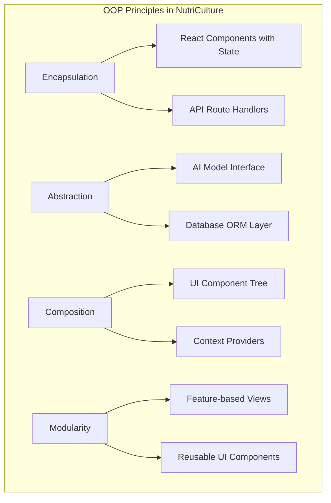
```mermaid
graph TD
    subgraph "OOP Principles in NutriCulture"
        A[Encapsulation] --> A1[React Components with State]
        A --> A2[API Route Handlers]
        
        B[Abstraction] --> B1[AI Model Interface]
        B --> B2[Database ORM Layer]
        
        C[Composition] --> C1[UI Component Tree]
        C --> C2[Context Providers]
        
        D[Modularity] --> D1[Feature-based Views]
        D --> D2[Reusable UI Components]
    end
```

---

## DIAGRAM 2: Agile Iterative Model Diagram

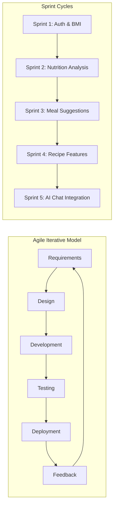
```mermaid
graph LR
    subgraph "Agile Iterative Model"
        A[Requirements] --> B[Design]
        B --> C[Development]
        C --> D[Testing]
        D --> E[Deployment]
        E --> F[Feedback]
        F --> A
    end
    
    subgraph "Sprint Cycles"
        S1[Sprint 1: Auth & BMI]
        S2[Sprint 2: Nutrition Analysis]
        S3[Sprint 3: Meal Suggestions]
        S4[Sprint 4: Recipe Features]
        S5[Sprint 5: AI Chat Integration]
    end
    
    S1 --> S2 --> S3 --> S4 --> S5
```

---

## DIAGRAM 3: System Context Diagram

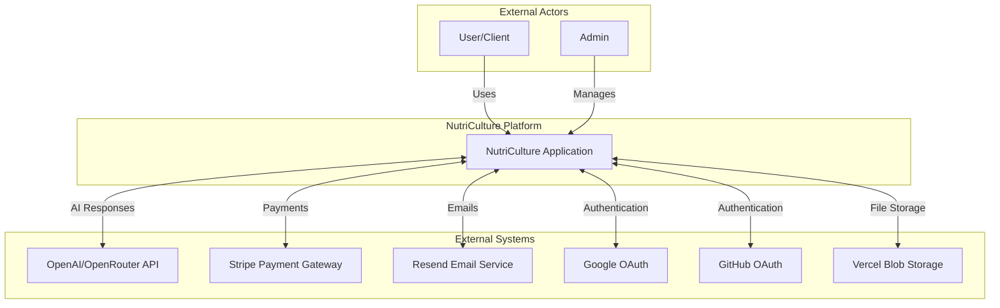
```mermaid
graph TB
    subgraph "External Actors"
        U[User/Client]
        A[Admin]
    end
    
    subgraph "External Systems"
        AI[OpenAI/OpenRouter API]
        ST[Stripe Payment Gateway]
        RE[Resend Email Service]
        GA[Google OAuth]
        GH[GitHub OAuth]
        VB[Vercel Blob Storage]
    end
    
    subgraph "NutriCulture Platform"
        NC[NutriCulture Application]
    end
    
    U -->|Uses| NC
    A -->|Manages| NC
    NC <-->|AI Responses| AI
    NC <-->|Payments| ST
    NC <-->|Emails| RE
    NC <-->|Authentication| GA
    NC <-->|Authentication| GH
    NC <-->|File Storage| VB
```

---

## DIAGRAM 4: Core Functionality Mind Map

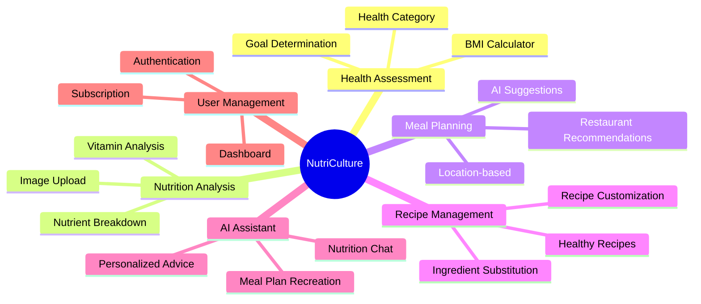
```mermaid
mindmap
  root((NutriCulture))
    Health Assessment
      BMI Calculator
      Goal Determination
      Health Category
    Nutrition Analysis
      Image Upload
      Nutrient Breakdown
      Vitamin Analysis
    Meal Planning
      AI Suggestions
      Restaurant Recommendations
      Location-based
    Recipe Management
      Healthy Recipes
      Recipe Customization
      Ingredient Substitution
    AI Assistant
      Nutrition Chat
      Personalized Advice
      Meal Plan Recreation
    User Management
      Authentication
      Subscription
      Dashboard
```

---

## DIAGRAM 5: High-Level Architecture Diagram

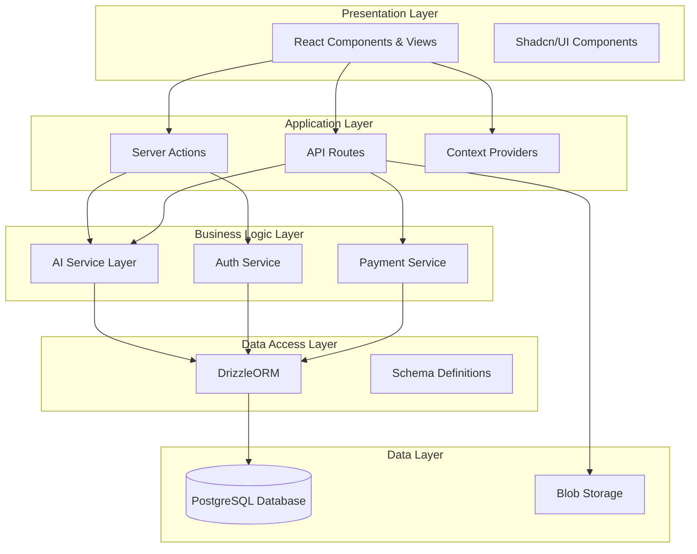
```mermaid
graph TB
    subgraph "Presentation Layer"
        UI[React Components & Views]
        SC[Shadcn/UI Components]
    end
    
    subgraph "Application Layer"
        SA[Server Actions]
        AR[API Routes]
        CT[Context Providers]
    end
    
    subgraph "Business Logic Layer"
        AI[AI Service Layer]
        AU[Auth Service]
        PM[Payment Service]
    end
    
    subgraph "Data Access Layer"
        ORM[DrizzleORM]
        SC2[Schema Definitions]
    end
    
    subgraph "Data Layer"
        DB[(PostgreSQL Database)]
        BL[Blob Storage]
    end
    
    UI --> SA
    UI --> AR
    UI --> CT
    SA --> AI
    SA --> AU
    AR --> AI
    AR --> PM
    AI --> ORM
    AU --> ORM
    PM --> ORM
    ORM --> DB
    AR --> BL
```

---

## DIAGRAM 6: Module Decomposition Diagram

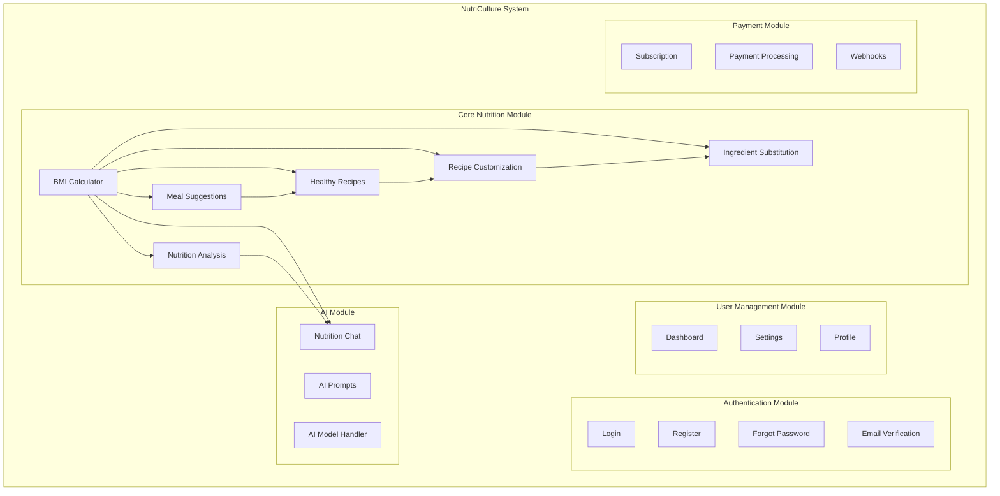
```mermaid
graph TB
    subgraph "NutriCulture System"
        subgraph "Authentication Module"
            LM[Login]
            RM[Register]
            FP[Forgot Password]
            EV[Email Verification]
        end
        
        subgraph "Core Nutrition Module"
            BC[BMI Calculator]
            NA[Nutrition Analysis]
            MS[Meal Suggestions]
            HR[Healthy Recipes]
            RC[Recipe Customization]
            IS[Ingredient Substitution]
        end
        
        subgraph "AI Module"
            NC[Nutrition Chat]
            AP[AI Prompts]
            AM[AI Model Handler]
        end
        
        subgraph "User Management Module"
            DB[Dashboard]
            ST[Settings]
            PR[Profile]
        end
        
        subgraph "Payment Module"
            SB[Subscription]
            PM[Payment Processing]
            WH[Webhooks]
        end
    end
    
    BC --> MS
    BC --> NA
    BC --> HR
    BC --> RC
    BC --> IS
    BC --> NC
    NA --> NC
    MS --> HR
    HR --> RC
    RC --> IS
```

---

## DIAGRAM 7: Component Diagram

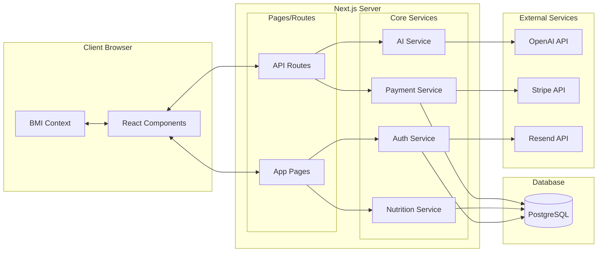
```mermaid
graph LR
    subgraph "Client Browser"
        RC[React Components]
        BX[BMI Context]
    end
    
    subgraph "Next.js Server"
        subgraph "Pages/Routes"
            AP[App Pages]
            API[API Routes]
        end
        
        subgraph "Core Services"
            AS[Auth Service]
            NS[Nutrition Service]
            AIS[AI Service]
            PS[Payment Service]
        end
    end
    
    subgraph "External Services"
        OAI[OpenAI API]
        STR[Stripe API]
        RES[Resend API]
    end
    
    subgraph "Database"
        PG[(PostgreSQL)]
    end
    
    RC <--> AP
    RC <--> API
    BX <--> RC
    AP --> AS
    AP --> NS
    API --> AIS
    API --> PS
    AIS --> OAI
    PS --> STR
    AS --> RES
    AS --> PG
    NS --> PG
    PS --> PG
```

---

## DIAGRAM 8: Deployment Architecture Diagram

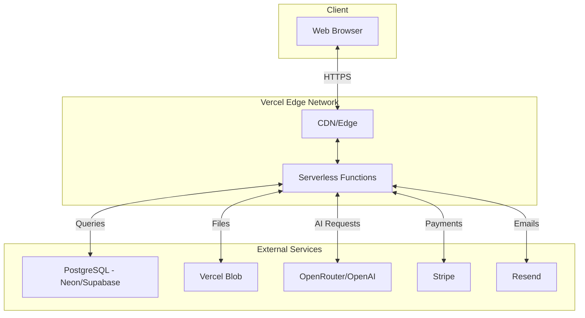
```mermaid
graph TB
    subgraph "Client"
        BR[Web Browser]
    end
    
    subgraph "Vercel Edge Network"
        CDN[CDN/Edge]
        SL[Serverless Functions]
    end
    
    subgraph "External Services"
        PG[PostgreSQL - Neon/Supabase]
        VB[Vercel Blob]
        AI[OpenRouter/OpenAI]
        ST[Stripe]
        RS[Resend]
    end
    
    BR <-->|HTTPS| CDN
    CDN <--> SL
    SL <-->|Queries| PG
    SL <-->|Files| VB
    SL <-->|AI Requests| AI
    SL <-->|Payments| ST
    SL <-->|Emails| RS
```

---

## DIAGRAM 9: Main User Journey Activity Diagram

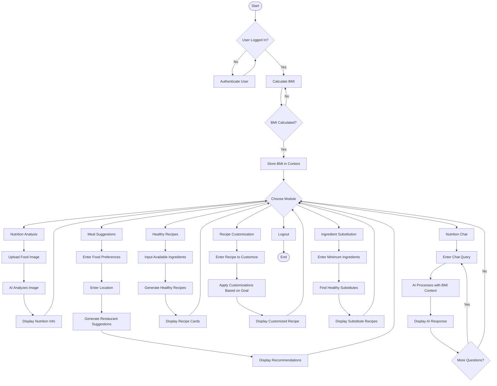
```mermaid
flowchart TD
    Start([Start]) --> Login{User Logged In?}
    Login -->|No| Auth[Authenticate User]
    Auth --> Login
    Login -->|Yes| BMI[Calculate BMI]
    
    BMI --> BMIResult{BMI Calculated?}
    BMIResult -->|Yes| StoreContext[Store BMI in Context]
    BMIResult -->|No| BMI
    
    StoreContext --> ChooseModule{Choose Module}
    
    ChooseModule --> NA[Nutrition Analysis]
    ChooseModule --> MS[Meal Suggestions]
    ChooseModule --> HR[Healthy Recipes]
    ChooseModule --> RC[Recipe Customization]
    ChooseModule --> IS[Ingredient Substitution]
    ChooseModule --> NC[Nutrition Chat]
    
    NA --> UploadImage[Upload Food Image]
    UploadImage --> AnalyzeImage[AI Analyzes Image]
    AnalyzeImage --> ShowNutrition[Display Nutrition Info]
    ShowNutrition --> ChooseModule
    
    MS --> EnterPrefs[Enter Food Preferences]
    EnterPrefs --> EnterLocation[Enter Location]
    EnterLocation --> GenerateSuggestions[Generate Restaurant Suggestions]
    GenerateSuggestions --> ShowRestaurants[Display Recommendations]
    ShowRestaurants --> ChooseModule
    
    HR --> InputIngredients[Input Available Ingredients]
    InputIngredients --> GenerateRecipes[Generate Healthy Recipes]
    GenerateRecipes --> ShowRecipes[Display Recipe Cards]
    ShowRecipes --> ChooseModule
    
    RC --> EnterRecipe[Enter Recipe to Customize]
    EnterRecipe --> CustomizeRecipe[Apply Customizations Based on Goal]
    CustomizeRecipe --> ShowCustomized[Display Customized Recipe]
    ShowCustomized --> ChooseModule
    
    IS --> EnterIngredients[Enter Minimum Ingredients]
    EnterIngredients --> FindSubstitutes[Find Healthy Substitutes]
    FindSubstitutes --> ShowSubstitutes[Display Substitute Recipes]
    ShowSubstitutes --> ChooseModule
    
    NC --> ChatQuery[Enter Chat Query]
    ChatQuery --> AIProcess[AI Processes with BMI Context]
    AIProcess --> ChatResponse[Display AI Response]
    ChatResponse --> MoreQuestions{More Questions?}
    MoreQuestions -->|Yes| ChatQuery
    MoreQuestions -->|No| ChooseModule
    
    ChooseModule --> Logout[Logout]
    Logout --> End([End])
```

---

## DIAGRAM 10: Nutrition Analysis Process Flow Diagram

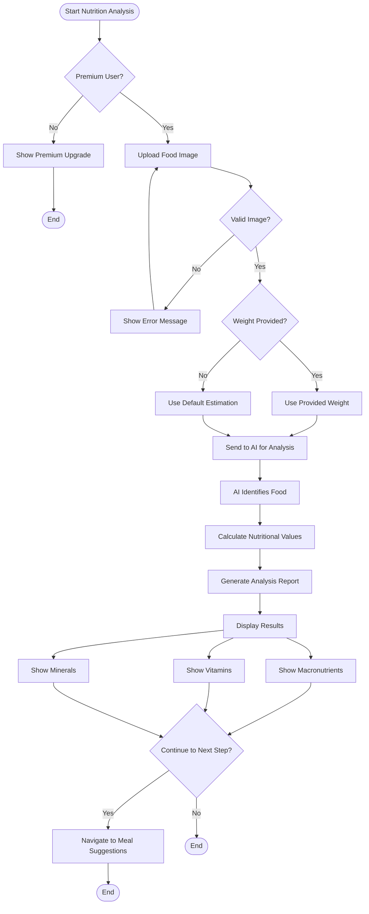
```mermaid
flowchart TD
    Start([Start Nutrition Analysis]) --> CheckPremium{Premium User?}
    CheckPremium -->|No| ShowUpgrade[Show Premium Upgrade]
    ShowUpgrade --> End1([End])
    
    CheckPremium -->|Yes| UploadImage[Upload Food Image]
    UploadImage --> ValidateImage{Valid Image?}
    ValidateImage -->|No| ShowError[Show Error Message]
    ShowError --> UploadImage
    
    ValidateImage -->|Yes| OptionalWeight{Weight Provided?}
    OptionalWeight -->|Yes| UseProvidedWeight[Use Provided Weight]
    OptionalWeight -->|No| EstimateWeight[Use Default Estimation]
    
    UseProvidedWeight --> SendToAI[Send to AI for Analysis]
    EstimateWeight --> SendToAI
    
    SendToAI --> ProcessImage[AI Identifies Food]
    ProcessImage --> CalculateNutrition[Calculate Nutritional Values]
    CalculateNutrition --> GenerateReport[Generate Analysis Report]
    
    GenerateReport --> DisplayResults[Display Results]
    DisplayResults --> ShowMacros[Show Macronutrients]
    DisplayResults --> ShowVitamins[Show Vitamins]
    DisplayResults --> ShowMinerals[Show Minerals]
    
    ShowMacros --> Proceed{Continue to Next Step?}
    ShowVitamins --> Proceed
    ShowMinerals --> Proceed
    
    Proceed -->|Yes| NavigateNext[Navigate to Meal Suggestions]
    Proceed -->|No| End2([End])
    NavigateNext --> End3([End])
```

---

## DIAGRAM 11: AI Chat Process Flow Diagram

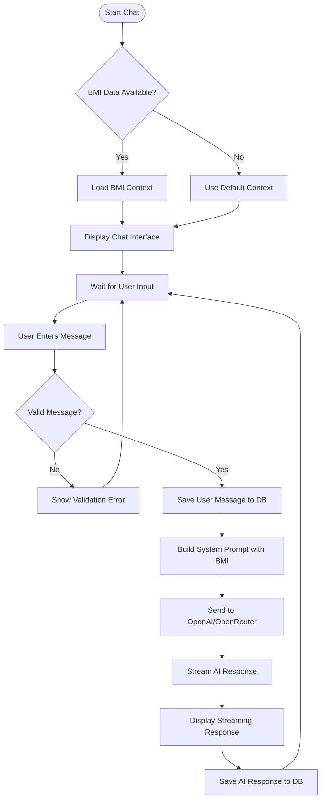
```mermaid
flowchart TD
    Start([Start Chat]) --> CheckBMI{BMI Data Available?}
    CheckBMI -->|Yes| LoadContext[Load BMI Context]
    CheckBMI -->|No| DefaultContext[Use Default Context]
    
    LoadContext --> ShowChat[Display Chat Interface]
    DefaultContext --> ShowChat
    
    ShowChat --> WaitInput[Wait for User Input]
    WaitInput --> UserMessage[User Enters Message]
    
    UserMessage --> ValidateInput{Valid Message?}
    ValidateInput -->|No| ShowInputError[Show Validation Error]
    ShowInputError --> WaitInput
    
    ValidateInput -->|Yes| SaveMessage[Save User Message to DB]
    SaveMessage --> BuildPrompt[Build System Prompt with BMI]
    
    BuildPrompt --> SendToAI[Send to OpenAI/OpenRouter]
    SendToAI --> StreamResponse[Stream AI Response]
    
    StreamResponse --> DisplayResponse[Display Streaming Response]
    DisplayResponse --> SaveResponse[Save AI Response to DB]
    
    SaveResponse --> WaitInput
```

---

## DIAGRAM 12: Class Diagram

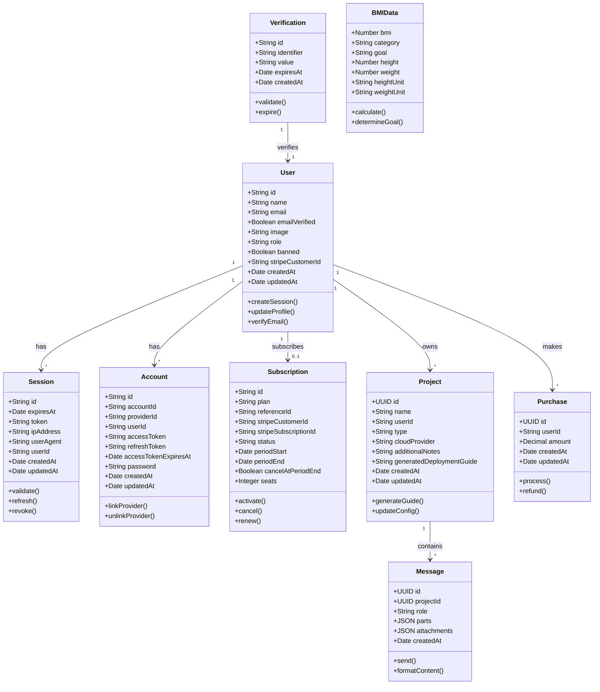
```mermaid
classDiagram
    class User {
        +String id
        +String name
        +String email
        +Boolean emailVerified
        +String image
        +String role
        +Boolean banned
        +String stripeCustomerId
        +Date createdAt
        +Date updatedAt
        +createSession()
        +updateProfile()
        +verifyEmail()
    }
    
    class Session {
        +String id
        +Date expiresAt
        +String token
        +String ipAddress
        +String userAgent
        +String userId
        +Date createdAt
        +Date updatedAt
        +validate()
        +refresh()
        +revoke()
    }
    
    class Account {
        +String id
        +String accountId
        +String providerId
        +String userId
        +String accessToken
        +String refreshToken
        +Date accessTokenExpiresAt
        +String password
        +Date createdAt
        +Date updatedAt
        +linkProvider()
        +unlinkProvider()
    }
    
    class Subscription {
        +String id
        +String plan
        +String referenceId
        +String stripeCustomerId
        +String stripeSubscriptionId
        +String status
        +Date periodStart
        +Date periodEnd
        +Boolean cancelAtPeriodEnd
        +Integer seats
        +activate()
        +cancel()
        +renew()
    }
    
    class Project {
        +UUID id
        +String name
        +String userId
        +String type
        +String cloudProvider
        +String additionalNotes
        +String generatedDeploymentGuide
        +Date createdAt
        +Date updatedAt
        +generateGuide()
        +updateConfig()
    }
    
    class Message {
        +UUID id
        +UUID projectId
        +String role
        +JSON parts
        +JSON attachments
        +Date createdAt
        +send()
        +formatContent()
    }
    
    class Purchase {
        +UUID id
        +String userId
        +Decimal amount
        +Date createdAt
        +Date updatedAt
        +process()
        +refund()
    }
    
    class Verification {
        +String id
        +String identifier
        +String value
        +Date expiresAt
        +Date createdAt
        +validate()
        +expire()
    }
    
    class BMIData {
        +Number bmi
        +String category
        +String goal
        +Number height
        +Number weight
        +String heightUnit
        +String weightUnit
        +calculate()
        +determineGoal()
    }
    
    User "1" --> "*" Session : has
    User "1" --> "*" Account : has
    User "1" --> "*" Project : owns
    User "1" --> "*" Purchase : makes
    User "1" --> "0..1" Subscription : subscribes
    Project "1" --> "*" Message : contains
    Verification "1" --> "1" User : verifies
```

---

## DIAGRAM 13: Component Class Diagram (React Components)

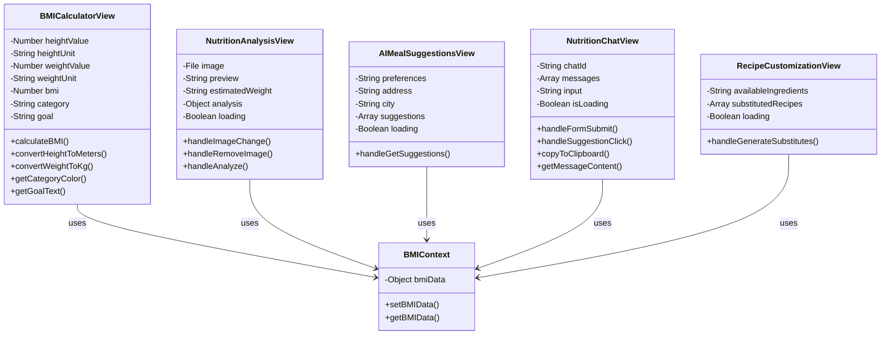
```mermaid
classDiagram
    class BMICalculatorView {
        -Number heightValue
        -String heightUnit
        -Number weightValue
        -String weightUnit
        -Number bmi
        -String category
        -String goal
        +calculateBMI()
        +convertHeightToMeters()
        +convertWeightToKg()
        +getCategoryColor()
        +getGoalText()
    }
    
    class NutritionAnalysisView {
        -File image
        -String preview
        -String estimatedWeight
        -Object analysis
        -Boolean loading
        +handleImageChange()
        +handleRemoveImage()
        +handleAnalyze()
    }
    
    class AIMealSuggestionsView {
        -String preferences
        -String address
        -String city
        -Array suggestions
        -Boolean loading
        +handleGetSuggestions()
    }
    
    class NutritionChatView {
        -String chatId
        -Array messages
        -String input
        -Boolean isLoading
        +handleFormSubmit()
        +handleSuggestionClick()
        +copyToClipboard()
        +getMessageContent()
    }
    
    class RecipeCustomizationView {
        -String availableIngredients
        -Array substitutedRecipes
        -Boolean loading
        +handleGenerateSubstitutes()
    }
    
    class BMIContext {
        -Object bmiData
        +setBMIData()
        +getBMIData()
    }
    
    BMICalculatorView --> BMIContext : uses
    NutritionAnalysisView --> BMIContext : uses
    AIMealSuggestionsView --> BMIContext : uses
    NutritionChatView --> BMIContext : uses
    RecipeCustomizationView --> BMIContext : uses
```

---

## DIAGRAM 14: BMI Calculation Sequence Diagram

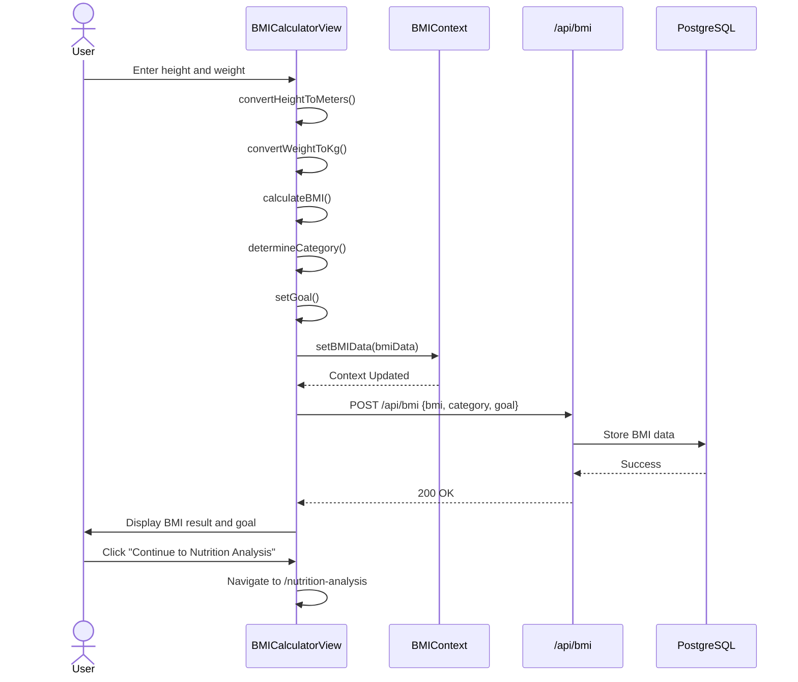
```mermaid
sequenceDiagram
    actor User
    participant UI as BMICalculatorView
    participant Context as BMIContext
    participant API as /api/bmi
    participant DB as PostgreSQL
    
    User->>UI: Enter height and weight
    UI->>UI: convertHeightToMeters()
    UI->>UI: convertWeightToKg()
    UI->>UI: calculateBMI()
    UI->>UI: determineCategory()
    UI->>UI: setGoal()
    
    UI->>Context: setBMIData(bmiData)
    Context-->>UI: Context Updated
    
    UI->>API: POST /api/bmi {bmi, category, goal}
    API->>DB: Store BMI data
    DB-->>API: Success
    API-->>UI: 200 OK
    
    UI->>User: Display BMI result and goal
    User->>UI: Click "Continue to Nutrition Analysis"
    UI->>UI: Navigate to /nutrition-analysis
```

---

## DIAGRAM 15: Nutrition Chat Sequence Diagram

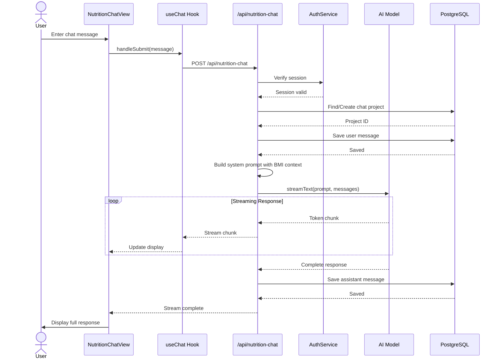
```mermaid
sequenceDiagram
    actor User
    participant UI as NutritionChatView
    participant Chat as useChat Hook
    participant API as /api/nutrition-chat
    participant Auth as AuthService
    participant Model as AI Model
    participant DB as PostgreSQL
    
    User->>UI: Enter chat message
    UI->>Chat: handleSubmit(message)
    Chat->>API: POST /api/nutrition-chat
    
    API->>Auth: Verify session
    Auth-->>API: Session valid
    
    API->>DB: Find/Create chat project
    DB-->>API: Project ID
    
    API->>DB: Save user message
    DB-->>API: Saved
    
    API->>API: Build system prompt with BMI context
    API->>Model: streamText(prompt, messages)
    
    loop Streaming Response
        Model-->>API: Token chunk
        API-->>Chat: Stream chunk
        Chat-->>UI: Update display
    end
    
    Model-->>API: Complete response
    API->>DB: Save assistant message
    DB-->>API: Saved
    
    API-->>UI: Stream complete
    UI->>User: Display full response
```

---

## DIAGRAM 16: Subscription Sequence Diagram

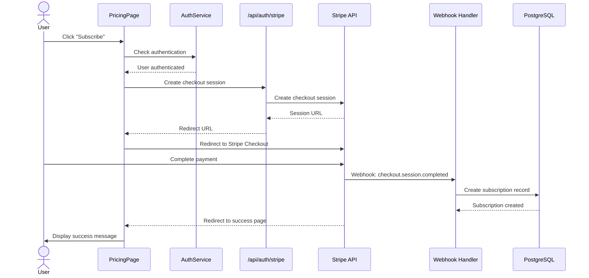
```mermaid
sequenceDiagram
    actor User
    participant UI as PricingPage
    participant Auth as AuthService
    participant API as /api/auth/stripe
    participant Stripe as Stripe API
    participant WH as Webhook Handler
    participant DB as PostgreSQL
    
    User->>UI: Click "Subscribe"
    UI->>Auth: Check authentication
    Auth-->>UI: User authenticated
    
    UI->>API: Create checkout session
    API->>Stripe: Create checkout session
    Stripe-->>API: Session URL
    API-->>UI: Redirect URL
    
    UI->>Stripe: Redirect to Stripe Checkout
    User->>Stripe: Complete payment
    
    Stripe->>WH: Webhook: checkout.session.completed
    WH->>DB: Create subscription record
    DB-->>WH: Subscription created
    
    Stripe-->>UI: Redirect to success page
    UI->>User: Display success message
```

---

## DIAGRAM 17: User Authentication State Diagram

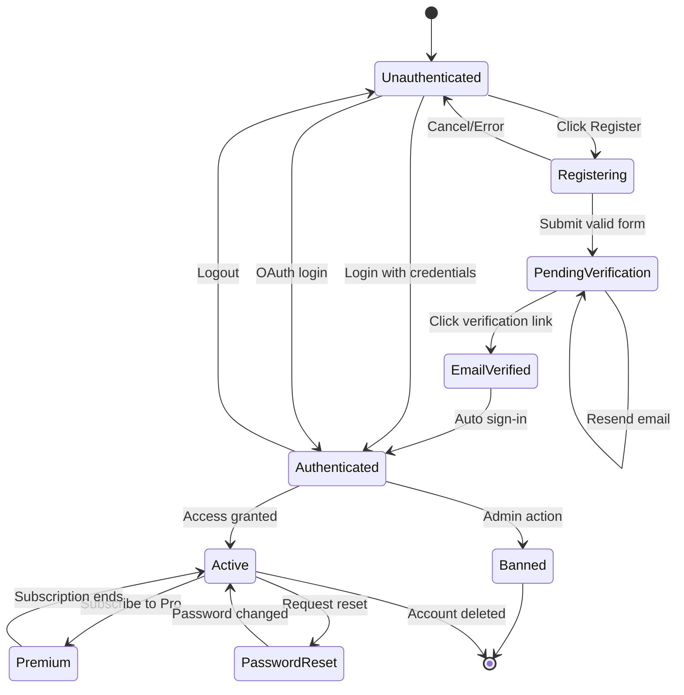
```mermaid
stateDiagram-v2
    [*] --> Unauthenticated
    
    Unauthenticated --> Registering : Click Register
    Registering --> PendingVerification : Submit valid form
    Registering --> Unauthenticated : Cancel/Error
    
    PendingVerification --> EmailVerified : Click verification link
    PendingVerification --> PendingVerification : Resend email
    
    EmailVerified --> Authenticated : Auto sign-in
    
    Unauthenticated --> Authenticated : Login with credentials
    Unauthenticated --> Authenticated : OAuth login
    
    Authenticated --> Active : Access granted
    Active --> Premium : Subscribe to Pro
    Premium --> Active : Subscription ends
    
    Active --> PasswordReset : Request reset
    PasswordReset --> Active : Password changed
    
    Authenticated --> Unauthenticated : Logout
    Authenticated --> Banned : Admin action
    Banned --> [*]
    
    Active --> [*] : Account deleted
```

---

## DIAGRAM 18: BMI Workflow State Diagram

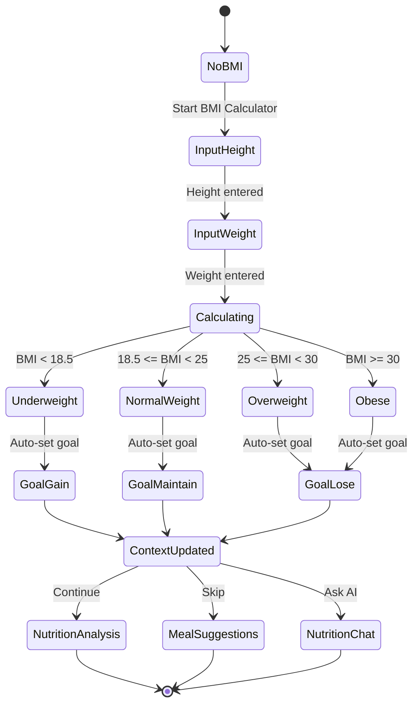
```mermaid
stateDiagram-v2
    [*] --> NoBMI
    
    NoBMI --> InputHeight : Start BMI Calculator
    InputHeight --> InputWeight : Height entered
    InputWeight --> Calculating : Weight entered
    
    Calculating --> Underweight : BMI < 18.5
    Calculating --> NormalWeight : 18.5 <= BMI < 25
    Calculating --> Overweight : 25 <= BMI < 30
    Calculating --> Obese : BMI >= 30
    
    Underweight --> GoalGain : Auto-set goal
    NormalWeight --> GoalMaintain : Auto-set goal
    Overweight --> GoalLose : Auto-set goal
    Obese --> GoalLose : Auto-set goal
    
    GoalGain --> ContextUpdated
    GoalMaintain --> ContextUpdated
    GoalLose --> ContextUpdated
    
    ContextUpdated --> NutritionAnalysis : Continue
    ContextUpdated --> MealSuggestions : Skip
    ContextUpdated --> NutritionChat : Ask AI
    
    NutritionAnalysis --> [*]
    MealSuggestions --> [*]
    NutritionChat --> [*]
```

---

## DIAGRAM 19: DFD Level 0 (Context Diagram)

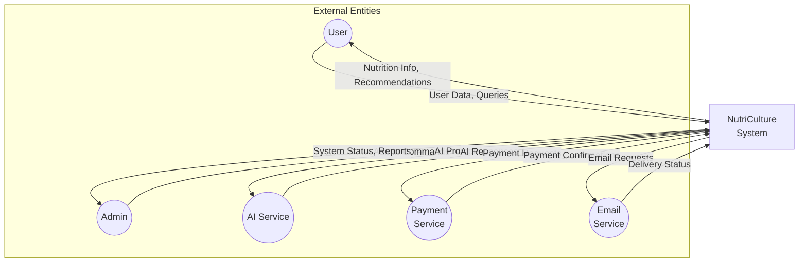
```mermaid
flowchart TB
    subgraph External Entities
        U((User))
        A((Admin))
        AI((AI Service))
        PM((Payment<br/>Service))
        EM((Email<br/>Service))
    end
    
    NC[NutriCulture<br/>System]
    
    U -->|User Data, Queries| NC
    NC -->|Nutrition Info, Recommendations| U
    
    A -->|Admin Commands| NC
    NC -->|System Status, Reports| A
    
    NC -->|AI Prompts| AI
    AI -->|AI Responses| NC
    
    NC -->|Payment Requests| PM
    PM -->|Payment Confirmations| NC
    
    NC -->|Email Requests| EM
    EM -->|Delivery Status| NC
```

---

## DIAGRAM 20: DFD Level 1

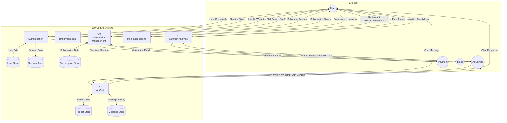
```mermaid
flowchart TB
    subgraph External
        U((User))
        AI((AI Service))
        PM((Payment))
        EM((Email))
    end
    
    subgraph "NutriCulture System"
        P1[1.0<br/>Authentication]
        P2[2.0<br/>BMI Processing]
        P3[3.0<br/>Nutrition Analysis]
        P4[4.0<br/>Meal Suggestions]
        P5[5.0<br/>AI Chat]
        P6[6.0<br/>Subscription<br/>Management]
        
        D1[(User Store)]
        D2[(Session Store)]
        D3[(Project Store)]
        D4[(Message Store)]
        D5[(Subscription Store)]
    end
    
    U -->|Login Credentials| P1
    P1 -->|Session Token| U
    P1 <-->|User Data| D1
    P1 <-->|Session Data| D2
    P1 -->|Verification Email| EM
    
    U -->|Height, Weight| P2
    P2 -->|BMI Result, Goal| U
    
    U -->|Food Image| P3
    P3 -->|Image Analysis Request| AI
    AI -->|Nutrition Data| P3
    P3 -->|Nutrition Breakdown| U
    
    U -->|Preferences, Location| P4
    P4 -->|Restaurant Recommendations| U
    
    U -->|Chat Message| P5
    P5 <-->|Project Data| D3
    P5 <-->|Message History| D4
    P5 -->|Prompt with Context| AI
    AI -->|AI Response| P5
    P5 -->|Chat Response| U
    
    U -->|Subscribe Request| P6
    P6 -->|Checkout Session| PM
    PM -->|Payment Status| P6
    P6 <-->|Subscription Data| D5
    P6 -->|Subscription Status| U
```

---

## DIAGRAM 21: DFD Level 2 - AI Chat Process

```mermaid
flowchart TB
    subgraph External
        U((User))
        AI((OpenAI/<br/>OpenRouter))
    end
    
    subgraph "5.0 AI Chat Process"
        P5_1[5.1<br/>Validate<br/>Session]
        P5_2[5.2<br/>Load/Create<br/>Chat Project]
        P5_3[5.3<br/>Save User<br/>Message]
        P5_4[5.4<br/>Build<br/>System Prompt]
        P5_5[5.5<br/>Stream<br/>AI Response]
        P5_6[5.6<br/>Save AI<br/>Response]
        
        D3[(Project<br/>Store)]
        D4[(Message<br/>Store)]
        D6[(BMI<br/>Context)]
    end
    
    U -->|Chat Message| P5_1
    P5_1 -->|Valid Session| P5_2
    P5_2 <-->|Project Data| D3
    P5_2 -->|Project ID| P5_3
    P5_3 -->|User Message| D4
    P5_3 -->|Message Saved| P5_4
    D6 -->|BMI Data| P5_4
    P5_4 -->|Full Prompt| P5_5
    P5_5 -->|API Request| AI
    AI -->|Streaming Response| P5_5
    P5_5 -->|Response Chunks| U
    P5_5 -->|Complete Response| P5_6
    P5_6 -->|AI Message| D4
```

---

## DIAGRAM 22: Entity-Relationship Diagram

```mermaid
erDiagram
    USERS ||--o{ SESSIONS : has
    USERS ||--o{ ACCOUNTS : has
    USERS ||--o{ PROJECTS : owns
    USERS ||--o{ PURCHASES : makes
    USERS ||--o| SUBSCRIPTIONS : subscribes
    PROJECTS ||--o{ MESSAGES : contains
    
    USERS {
        text id PK
        text name
        text email UK
        boolean emailVerified
        text image
        text role
        boolean banned
        text banReason
        timestamp banExpires
        text stripeCustomerId
        timestamp createdAt
        timestamp updatedAt
    }
    
    SESSIONS {
        text id PK
        timestamp expiresAt
        text token UK
        text ipAddress
        text userAgent
        text impersonatedBy
        text userId FK
        timestamp createdAt
        timestamp updatedAt
    }
    
    ACCOUNTS {
        text id PK
        text accountId
        text providerId
        text userId FK
        text accessToken
        text refreshToken
        text idToken
        timestamp accessTokenExpiresAt
        timestamp refreshTokenExpiresAt
        text scope
        text password
        timestamp createdAt
        timestamp updatedAt
    }
    
    SUBSCRIPTIONS {
        text id PK
        text plan
        text referenceId
        text stripeCustomerId
        text stripeSubscriptionId
        text status
        timestamp periodStart
        timestamp periodEnd
        boolean cancelAtPeriodEnd
        integer seats
    }
    
    PROJECTS {
        uuid id PK
        text name
        text userId FK
        text cloudProvider
        text additionalNotes
        text type
        text configFileContent
        text optimizationType
        text applicationType
        text language
        text framework
        text generatedDeploymentGuide
        timestamp createdAt
        timestamp updatedAt
    }
    
    MESSAGES {
        uuid id PK
        uuid projectId FK
        text role
        json parts
        json attachments
        timestamp createdAt
    }
    
    PURCHASES {
        uuid id PK
        text userId FK
        numeric amount
        timestamp createdAt
        timestamp updatedAt
    }
    
    VERIFICATIONS {
        text id PK
        text identifier
        text value
        timestamp expiresAt
        timestamp createdAt
        timestamp updatedAt
    }
```

---

## DIAGRAM 23: Screen Flow Diagram

```mermaid
flowchart TD
    subgraph "Public Pages"
        HP[Home Page]
        LP[Login Page]
        RP[Register Page]
        FP[Forgot Password]
        PR[Pricing Page]
        SV[Services Page]
    end
    
    subgraph "Protected Pages"
        GS[Get Started]
        BC[BMI Calculator]
        NA[Nutrition Analysis]
        MS[AI Meal Suggestions]
        HR[Healthy Recipes]
        RC[Recipe Customization]
        IS[Ingredient Substitution]
        NC[Nutrition Chat]
        DB[Dashboard]
        ST[Settings]
    end
    
    HP --> LP
    HP --> RP
    HP --> PR
    HP --> SV
    LP --> DB
    RP --> LP
    FP --> LP
    
    DB --> GS
    GS --> BC
    BC --> NA
    BC --> MS
    NA --> MS
    MS --> HR
    HR --> RC
    RC --> IS
    
    DB --> NC
    DB --> ST
    
    NA -.->|Chat Link| NC
    MS -.->|Chat Link| NC
    HR -.->|Chat Link| NC
```

---

## DIAGRAM 24: UI Component Architecture

```mermaid
graph TD
    subgraph "Layout Components"
        NB[Navbar]
        SB[Sidebar]
        FT[Footer]
    end
    
    subgraph "UI Primitives"
        BT[Button]
        IN[Input]
        CD[Card]
        AL[Alert]
        DD[Dropdown]
        TA[Textarea]
        SA[ScrollArea]
    end
    
    subgraph "Feature Components"
        BC[BMI Calculator Form]
        NA[Nutrition Analysis Form]
        CH[Chat Interface]
        RC[Recipe Cards]
    end
    
    subgraph "Context Providers"
        TP[Theme Provider]
        BP[BMI Provider]
        LP[Loading Provider]
    end
    
    TP --> NB
    TP --> SB
    TP --> FT
    BP --> BC
    BP --> NA
    BP --> CH
    LP --> BC
    LP --> NA
    
    BT --> BC
    IN --> BC
    CD --> BC
    BT --> NA
    IN --> NA
    CD --> NA
    SA --> CH
    IN --> CH
    BT --> CH
```

---

## How to Use These Diagrams

1. Go to https://mermaid.live
2. Delete any existing code in the editor
3. Copy the code block between the triple backticks (```mermaid and ```)
4. Paste into the Mermaid Live Editor
5. The diagram will render automatically
6. Download as PNG or SVG using the export button
7. Insert the image into your Word document at the corresponding [INSERT DIAGRAM X] placeholder

**Note:** Some diagrams may need slight adjustments for optimal display. The mindmap diagram (Diagram 4) may require Mermaid version 9.3+ to render properly.


